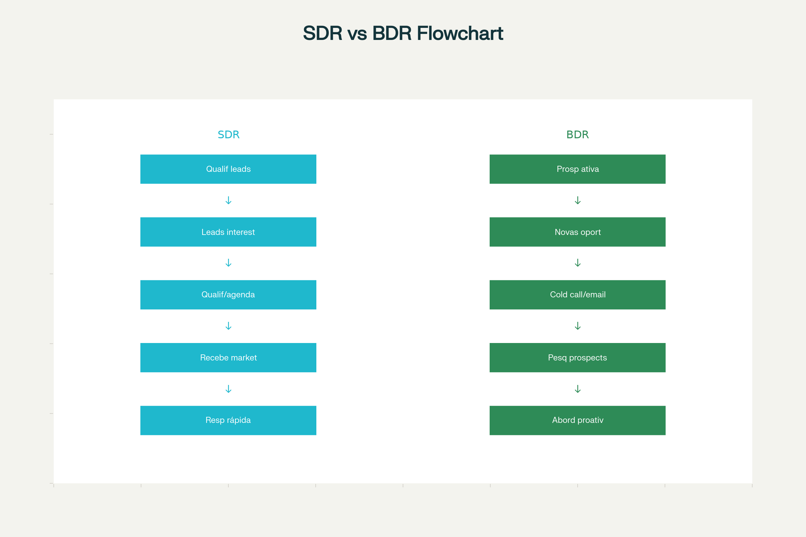
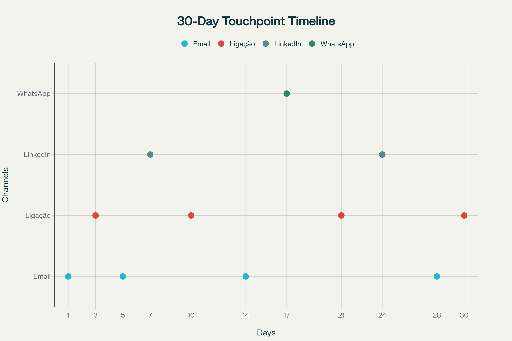

# Guia Completo: Como Melhorar o Trabalho de SDR e BDR

Este guia abrangente fornece estratégias práticas e estruturadas para otimizar o desempenho de profissionais de Sales Development Representative (SDR) e Business Development Representative (BDR), cobrindo desde as diferenças fundamentais entre os papéis até metodologias avançadas de organização e execução.

## Principais Diferenças entre SDR e BDR

A compreensão clara das distinções entre SDR e BDR é fundamental para estruturar uma operação comercial eficiente. **O SDR (Sales Development Representative) foca na qualificação de leads que já demonstraram interesse**, enquanto **o BDR (Business Development Representative) concentra-se na prospecção ativa e criação de novas oportunidades**[1][2][3].

### Funções do SDR

O SDR atua como intermediário entre marketing e vendas, trabalhando principalmente com leads inbound. Suas principais responsabilidades incluem **resposta rápida a leads interessados (idealmente dentro de 1 hora)**, qualificação por perfil e necessidade, execução de discovery calls, e agendamento de reuniões para closers[4][5]. O profissional SDR deve dominar técnicas de qualificação como SPIN Selling e metodologias BANT para identificar leads com real potencial de conversão[6].

### Funções do BDR

O BDR é responsável pela **prospecção ativa outbound**, criando oportunidades onde elas não existiam anteriormente. Este profissional realiza pesquisa de mercado, identifica prospects ideais, executa cold calling e cold emailing, desenvolve listas de contatos qualificadas, e mapeia tomadores de decisão[1][7][8]. O BDR trabalha essencialmente "abrindo portas" em empresas que ainda não conhecem a solução oferecida.

## Rotina Diária e Organização do Trabalho

### Estrutura do Dia a Dia do SDR

A rotina de um SDR de alta performance segue uma estrutura organizacional baseada na **matriz de impacto x esforço**, priorizando atividades que geram maior resultado com menor esforço[9]. As atividades diárias incluem resposta imediata a leads inbound, execução de cadências de follow-up, atualização constante do CRM, realização de discovery calls, e nutrição estratégica de leads não prontos para compra[4][5].

O profissional deve dedicar aproximadamente **60-80 touchpoints por dia**, sendo que 18% do tempo é gasto em registro e organização de atividades[10]. A gestão eficiente desse tempo é crucial para maximizar a produtividade e evitar sobrecarga operacional.

### Estrutura do Dia a Dia do BDR

O BDR organiza sua rotina em torno da **prospecção ativa sistemática**, iniciando com pesquisa detalhada de mercado e identificação de prospects que se encaixam no ICP (Ideal Customer Profile). A cadência de contatos outbound representa o núcleo de suas atividades, incluindo cold calling estruturado, sequências de email personalizadas, e abordagens via LinkedIn Sales Navigator[8][11].

A rotina inclui também qualificação inicial de prospects frios, mapeamento de estruturas organizacionais das empresas-alvo, e criação contínua de listas de contatos qualificadas. **Um bom BDR não apenas faz contatos, mas mede sistematicamente seus esforços** utilizando ferramentas como CRMs para acompanhar performance e otimizar abordagens[11].

## Estratégia de 12 Touch Points

### Metodologia e Distribuição

A estratégia de 12 touch points baseia-se no princípio de que **85% dos leads são convertidos apenas após a sexta tentativa de contato**, demonstrando a importância de uma abordagem persistente e estruturada[12]. Esta metodologia distribui os contatos ao longo de 30 dias, utilizando múltiplos canais para maximizar as chances de conexão.

### Canais e Timing Estratégico

A distribuição ideal dos 12 touchpoints inclui **4-5 emails**, **3-4 ligações**, **2-3 contatos via LinkedIn**, e **1-2 mensagens WhatsApp** quando apropriado. O timing entre contatos segue uma progressão estratégica: contato inicial no dia 1, primeiro follow-up no dia 3, expansão para outros canais nos dias 7 e 14, e intensificação nos dias finais da cadência[13][12][14].

**O princípio fundamental é nunca realizar mais de 2 contatos consecutivos do mesmo tipo**, garantindo variação na abordagem e evitando saturação do prospect. Cada touchpoint deve agregar valor único, seja através de insights relevantes, conteúdo educativo, ou social proof específico para o perfil do lead[10][15].

### Intervalos e Pausas Estratégicas

Os intervalos entre touchpoints seguem uma **progressão não-linear**, com pausas mais curtas no início (1-2 dias) e espaçamentos maiores conforme a cadência avança (5-7 dias). Esta abordagem respeita o tempo de processamento do prospect enquanto mantém presença consistente. Entre cada touchpoint, é essencial incluir **períodos de pausa de 24-48 horas** para permitir resposta antes do próximo contato[13][14].

## Organização usando Trello como Ferramenta Kanban

### Estrutura do Pipeline Visual

O Trello oferece uma solução visual eficiente para gerenciar o pipeline de vendas de SDRs e BDRs através do **sistema Kanban**. A estrutura recomendada inclui 8 listas principais: Leads Novos, Primeiro Contato, Follow-up, Qualificados, Reunião Agendada, Passado para Vendas, Desqualificados, e Recursos[16][17][18].

Cada cartão representa um lead individual e move-se da esquerda para a direita conforme progride no funil. **A organização visual permite identificação imediata de gargalos** e oportunidades de otimização no processo comercial[17][19].

### Funcionalidades Avançadas

As funcionalidades avançadas do Trello incluem **checklists padronizados para pontos de contato**, sistema de labels para priorização (Hot Lead, Urgente, High Value, ICP Perfect), e anexos para documentos relevantes. A atribuição de membros permite distribuição clara de responsabilidades, enquanto as datas de vencimento garantem follow-ups pontuais[16][17].

**Power-ups como integração com Salesforce e ferramentas de email** expandem as capacidades nativas do Trello, transformando-o em uma plataforma CRM robusta. Automações podem mover cartões automaticamente baseadas em critérios predefinidos, reduzindo trabalho manual repetitivo[20][18].

### Gestão de Recursos e Templates

A lista "Recursos" centraliza **scripts de abordagem**, templates de email, cases de sucesso, e materiais de objection handling. Esta centralização garante que toda a equipe tenha acesso aos mesmos recursos atualizados, promovendo consistência na abordagem e mensagens[17].

Templates padronizados para diferentes tipos de leads aceleram a criação de novos cartões, enquanto checklists personalizados garantem que nenhuma etapa importante seja esquecida no processo de qualificação[18][19].

## Abordagem e Pauta para Reuniões Discovery

### Estrutura da Discovery Call

A **discovery call é o primeiro contato aprofundado com um prospect qualificado**, com duração ideal de 30-45 minutos. A estrutura segue 6 fases distintas: abertura e rapport (5-10 min), definição de agenda (5 min), investigação SPIN (20-25 min), identificação de implicações (5-10 min), exploração de benefícios (5-10 min), e próximos passos (5 min)[21][22][23].

### Metodologia SPIN Selling

A metodologia SPIN (Situation, Problem, Implication, Need-payoff) estrutura as perguntas da discovery call para **maximizar a identificação de necessidades e criar urgência**. Perguntas de Situação mapeiam o contexto atual, perguntas de Problema identificam dores específicas, perguntas de Implicação amplificam consequências, e perguntas de Need-payoff visualizam benefícios da solução[24][22][6].

**Perguntas exemplo incluem**: "Como vocês fazem [processo] hoje?", "Quais os maiores desafios?", "Qual o impacto financeiro desse problema?", e "Como seria o cenário ideal?"[25][23]. A progressão lógica dessas perguntas conduz o prospect a reconhecer necessidades e valorizar soluções potenciais.

### Preparação e Execução

A preparação adequada inclui **pesquisa prévia sobre a empresa e setor**, definição clara de objetivos para a call, e criação de agenda estruturada enviada previamente. Durante a execução, o foco deve estar na **escuta ativa** (80% ouvir, 20% falar) e na construção de rapport genuíno[21][26][25].

O encerramento eficaz confirma próximos passos, define timeline claro, e identifica todos os stakeholders necessários para o processo de decisão. **Sempre termine com compromisso concreto e data definida** para manter o momentum do processo comercial[27][23].

## Scripts para Entrevistar Gestores sobre Produtos

### Categorias de Perguntas Essenciais

O desenvolvimento de expertise sobre produtos/serviços requer **entrevistas estruturadas com gestores experientes**. As categorias principais incluem: características e funcionalidades do produto, perfil de cliente ideal, processo de vendas, objeções comuns e argumentações, cenário competitivo, e métricas de sucesso[28][29][30].

### Perguntas sobre Produto e Mercado

**Perguntas fundamentais sobre produto**: "Quais as principais funcionalidades?", "Que problema específico resolvemos?", "Quais nossos maiores diferenciais?", "Como nos comparamos aos concorrentes?", "Quais funcionalidades os clientes mais valorizam?"[31][30]. Estas perguntas estabelecem base sólida de conhecimento técnico e posicionamento.

**Perguntas sobre mercado e competição**: "Quem são nossos principais concorrentes?", "Como nos posicionamos no mercado?", "Que tendências impactam nosso setor?", "Onde ganhamos/perdemos para concorrentes?"[31]. O entendimento competitivo é crucial para argumentação eficaz e diferenciação.

### Perguntas sobre Vendas e Objeções

A preparação para objeções comuns requer **mapeamento detalhado de cenários reais**: "Quais objeções mais frequentes?", "Como responder à objeção de preço?", "Que argumentos funcionam melhor?", "Quais cases usar como exemplo?"[29][31].

**Perguntas sobre processo comercial**: "Qual nosso ciclo médio de vendas?", "Qual ticket médio?", "Quem são os tomadores de decisão?", "Qual nossa taxa de conversão?"[31]. Estas informações orientam expectativas realistas e estratégias de abordagem.

### Execução e Follow-up

A execução eficaz da entrevista inclui **gravação (com permissão) para referência posterior**, anotações detalhadas durante a conversa, solicitação de exemplos específicos e cases reais, e agendamento de follow-ups regulares para esclarecimentos adicionais[29].

**Dicas práticas**: peça materiais complementares (apresentações, estudos), esclareça dúvidas imediatamente, solicite feedback sobre primeiras abordagens, e mantenha canal aberto para dúvidas contínuas. O objetivo é **transformar conhecimento tácito dos gestores em scripts e argumentações práticas** para uso no dia a dia comercial.

## Ferramentas e Tecnologias de Apoio

### Stack Tecnológico Recomendado

O stack tecnológico moderno para SDRs e BDRs deve incluir **CRM robusto** (Salesforce, HubSpot, Pipedrive), ferramentas de cadência (Outreach, Salesloft, Reev), LinkedIn Sales Navigator para prospecção social, ferramentas de email tracking, e plataformas de agendamento automatizado[32][30].

### Automação e Eficiência

**Automações estratégicas** reduzem trabalho manual repetitivo: sequências de email automatizadas, follow-ups baseados em comportamento, pontuação automática de leads, e relatórios de performance em tempo real. O objetivo é **maximizar tempo dedicado a atividades de alto valor** como discovery calls e relacionamento personalizado[12][32].

## Conclusão

O sucesso de SDRs e BDRs depende da **combinação entre metodologia estruturada, ferramentas adequadas, e execução consistente**. A diferenciação clara de papéis, implementação de cadências organizadas, uso inteligente de tecnologia, e desenvolvimento contínuo de conhecimento sobre produtos e mercado são pilares fundamentais para resultados excepcionais.

A aplicação sistemática dessas estratégias, adaptadas à realidade específica de cada empresa e mercado, permite **escalabilidade sustentável e previsibilidade de resultados** no processo comercial. O investimento em estruturação adequada desses profissionais representa retorno significativo em performance comercial e crescimento organizacional.

## Fontes
- [1] ANÁLISE COMPARATIVA ENTRE OPERAÇÕES COM BDRS E COMPRA DIRETA DE AÇÕES ESTRANGEIRAS POR CORRETORAS INTERNACIONAIS https://www.openaccessojs.com/JBReview/article/view/5531
- [2] Impacto do uso de corticosteroides nos desfechos gestacionais https://periodicos.unicesumar.edu.br/index.php/saudpesq/article/view/12500
- [3] Cn Aonrr(cid:0)AtistoWi Ch f coclbcr hl ShrtWi ?yclshnl EWycol ? f cbs PcWobe D f hbhclbu nl Vcarhscr-@ https://www.semanticscholar.org/paper/078428681791bf59dad2a573ecd5b5b9a1e22275
- [4] Os efeitos do CPAP selo d'água em recém nascidos prematuros: Uma revisão integrativa https://ojs.brazilianjournals.com.br/ojs/index.php/BJHR/article/view/56105
- [5] Classification and detection of diabetic retinopathy using K-means algorithm https://ieeexplore.ieee.org/document/7755294/
- [6] AÇÃO PEDAGÓGICA NA ESCOLA https://www.semanticscholar.org/paper/8123d9d2fdc33717405e0dd6576b8d37706196a7
- [7] Prevalência de sobrepeso e obesidade em escolares com idade de 7 a 17 anos, residentes nos municípios pertencentes à secretaria de desenvolvimento regional de São Miguel do Oeste/SC https://periodicos.sbu.unicamp.br/ojs/index.php/conexoes/article/view/8637631
- [8] Efeito da base de ionomero de vidro e resinas aplicáveis bulk fill em tensões de contração em molares ativadas endodonticamente https://www.semanticscholar.org/paper/8b4626b7ede7882f8489e17b397431bb7dba6030
- [9] Analisar a resistência a fratura de restaurações diretas de resinas compostas com a técnica incremental associada a base de ionômero de vidro e com resinas bulk fill https://www.semanticscholar.org/paper/2f9071c1d8508c7895ef052acf349d2487c65f1e
- [10] Profundidade de cura das resinas bulk fill variando a fonte de luz https://rsdjournal.org/index.php/rsd/article/view/9190
- [11] Differences in clinical significance of bronchodilator responses measured by forced expiratory volume in 1 second and forced vital capacity https://dx.plos.org/10.1371/journal.pone.0282256
- [12] Differences in clinical significance of bronchodilator responses measured by forced expiratory volume in 1 second and forced vital capacity https://pmc.ncbi.nlm.nih.gov/articles/PMC9955608/
- [13] Assessing the Impact of the Updated 2021 European Respiratory Society/American Thoracic Society Criteria on Bronchodilator Responsiveness in Asthma https://pmc.ncbi.nlm.nih.gov/articles/PMC11395171/
- [14] Assessing the Impact of the Updated 2021 European Respiratory Society/American Thoracic Society Criteria on Bronchodilator Responsiveness in Asthma https://www.cureus.com/articles/253481-assessing-the-impact-of-the-updated-2021-european-respiratory-societyamerican-thoracic-society-criteria-on-bronchodilator-responsiveness-in-asthma
- [15] New Guidelines for Bronchodilator Responsiveness in COPD: A Test in Search of a Use. https://pmc.ncbi.nlm.nih.gov/articles/PMC10392779/
- [16] Combined FEV1 and FVC Bronchodilator Response, Exacerbations, and Mortality in COPD. https://pmc.ncbi.nlm.nih.gov/articles/PMC6600841/
- [17] Diagnostic accuracy of the bronchodilator response in children. https://pmc.ncbi.nlm.nih.gov/articles/PMC3759549/
- [18] Prevalence, Diagnostic Utility and Associated Characteristics of Bronchodilator Responsiveness https://pmc.ncbi.nlm.nih.gov/articles/PMC10878375/
- [19] Rastreamento do Transtorno de Despersonalização/Desrealização em Estudantes de Medicina de uma Universidade Federal no Brasil http://www.scielo.br/pdf/rbem/v40n3/1981-5271-rbem-40-3-0337.pdf
- [20] Bronchodilator Responsiveness in Tobacco-Exposed Persons with or without COPD. https://pmc.ncbi.nlm.nih.gov/articles/PMC9993341/
- [21] BDR vs SDR: Diferenças, Funções e Como Escolher a Melhor ... https://otimizar.me/bdr-vs-sdr-diferencas-funcoes-e-como-escolher-a-melhor-estrategia-para-seu-negocio/
- [22] SDR e BDR: entenda a diferença de uma vez por todas https://deskmanager.com.br/blog/sdr-bdr/
- [23] BDR vs SDR: key differences & choosing the right sales role https://www.amplemarket.com/blog/bdr-vs-sdr-whats-the-difference-and-which-sales-role-is-right-for-you
- [24] O que é BDR e SDR - Sales Development Representative? - Agendor https://www.agendor.com.br/blog/bdr-e-sdr/
- [25] SDR e BDR: Guia Definitivo para Pré-Vendas https://qualifiquei.com.br/blog/vendas/sdr-e-bdr-guia-pre-vendas/
- [26] BDRs, SDRs, and account executives - what sets them apart? https://www.salesenablementcollective.com/the-role-of-bdrs-sdrs-vs-account-executives/
- [27] BDR e SDR explicados! Diferenças, exemplos e dicas práticas para ... https://www.youtube.com/watch?v=2I-ISlimAjU
- [28] SDR, BDR e Closer - otimizar o funil de vendas - LinkedIn https://pt.linkedin.com/pulse/sdr-bdr-e-closer-otimizando-o-funil-de-vendas-atrav%C3%A9s-patrocinio-qvkof
- [29] SDR vs BDR: Difference in Responsibilities In 2025 | 310 Creative https://www.310creative.com/blog/sales-sdr-vs-bdr
- [30] Qual é a diferença entre SDR e BDR? - Atendare https://atendare.com/br/blog/qual-e-a-diferenca-entre-sdr-e-bdr/
- [31] Guia de Salários Atualizados 2025/2026: SDR, BDR e LDR https://contactsdr.com.br/salarios-sdr-bdr-ldr-2025/
- [32] SDR vs BDR - What's the difference? Missions & Salary - Akimbo https://www.akimbo.eu/en/blog/sdr-vs-bdr-whats-the-difference
- [33] Funções de BDR e SDR no Funil em Y: Entenda as Diferenças https://ipanemacomunicacao.com.br/funcoes-de-bdr-e-sdr-no-funil-em-y-entenda-as-diferencas/
- [34] Business Development Representative: Diferenças Entre SDR e BDR https://meetime.com.br/blog/vendas/sdr-bdr-diferenca/
- [35] Full cycle sales rep V SDR/BDR/AE-what's the difference? https://bigbusinessagency.com/insights/sdr-bdr-ae-and-a-full-cycle-sales-rep-whats-the-difference
- [36] LDR, SDR e BDR: Quem são e o que fazem? - Salesforce https://www.salesforce.com/br/blog/ldr-sdr-bdr/
- [37] Understanding Different Sales Roles: SDR, BDR, AE, and AM https://www.surfe.com/blog/understanding-different-sales-roles/
- [38] SDR, BDR e LDR:entenda a diferença - Scooto https://scooto.co/sdr-bdr-ldr-diferenca/
- [39] Inside Sales Job Titles Explained: What SDRs, BDRs, ISRs & AEs ... https://www.revenue.io/blog/confused-about-inside-sales-job-titles
- [40] LDR, SDR, BDR: conheça os profissionais de vendas complexas https://www.exactsales.com.br/ldr-bdr-sdr/
- [41] Una arriesgada posteridad. El riesgo como estrategia filosófica en Jacques Derrida y Jean-Luc Nancy. https://www.semanticscholar.org/paper/c24a14416236c5efe2373343ac3016e1e515ef92
- [42] Análise dos Retornos e Características da Estratégia de Risk Arbitrage no Brasil https://www.semanticscholar.org/paper/7ddb0901108af449b2e24797ce9ce840c84fb0df
- [43] Los factores críticos del éxito en la adopción de una estrategia de CRM https://www.semanticscholar.org/paper/6aa62fb9486dbd9fe0cf37189c5991a7478d6db6
- [44] ESTRATÉGIAS EMPRESARIAIS NO CONTEXTO DA PANDEMIA DE COVID-19: UM ESTUDO EM PEQUENAS EMPRESAS FAMILIARES DO SETOR DE VESTUÁRIO https://periodicos.uniarp.edu.br/index.php/visao/article/view/3136
- [45] A estratégia da comunicação integrada de marketing no contexto da cultura da convergência midiática : um estudo das aplicações pelas marcas http://cascavel.ufsm.br/revistas/ojs-2.2.2/index.php/ccomunicacao/article/view/8994
- [46] BIG Picture: El modelo de innovacíon (Big Picture - The Graz Innovation Model) https://www.ssrn.com/abstract=3850007
- [47] Barreras para el acceso y el uso del condón desde la perspectiva de género http://revistas.ujat.mx/index.php/horizonte/article/view/2306
- [48] Adoption of Quick Response and inventory management in fast fashion: two case studies in the state of Minas Gerais https://www.semanticscholar.org/paper/dc82daf01d6d69f3e18e5766503c177fea0c830c
- [49] EFEITOS DA EXONERAÇÃO DO DEVEDOR DO SALDO REMANESCENTE NA ALIENAÇÃO FIDUCIÁRIA COM A ADVENTO DA LEI Nº 10.931/2004 http://revista.unicuritiba.edu.br/index.php/RevJur/article/view/3394
- [50] Analysis of satisfaction of final consumers: a study in a company of Vending Machines sector in the city of Santa Maria – RS https://www.semanticscholar.org/paper/6c5f649d2e8b6261e4ed6a67cd490de7692adb02
- [51] A INTERAÇÃO FACE A FACE E O ATENDIMENTO AO CLIENTE https://periodicos.ufsm.br/animus/article/download/37900/pdf
- [52] Neuromarketing com aplicabilidade de técnicas de gatilhos mentais para atração e persuasão de clientes https://periodicos.uerr.edu.br/index.php/ambiente/article/download/1247/762
- [53] Omnichannel: A estratégia próspera dos negócios em um mundo cada vez mais conectado https://www.nucleodoconhecimento.com.br/wp-content/uploads/2021/03/estrategia-prospera.pdf
- [54] Designing satisfying service encounters: website versus store touchpoints https://pmc.ncbi.nlm.nih.gov/articles/PMC8480457/
- [55] MARKETING DE RELACIONAMENTO: PRÁTICAS PARA CONQUISTAR O NOVO PERFIL DE CONSUMIDOR https://periodicorease.pro.br/rease/article/download/10313/4112
- [56] Decodificando websites: Como criar uma imagem mental distintiva para os serviços de hotelaria? https://rbtur.org.br/rbtur/article/download/569/pdf_1
- [57] ESTRATÉGIAS DE MARKETING DIGITAL NAS MÍDIAS SOCIAIS COMO FERRAMENTAS DE APROXIMAÇÃO ENTRE CLIENTE E EMPRESA https://www.nucleodoconhecimento.com.br/wp-content/uploads/2019/12/marketing-digital.pdf
- [58] O marketing digital aplicado no e-commerce: marketing de conteúdo https://www.nucleodoconhecimento.com.br/wp-content/uploads/2022/11/marketing-de-conteudo-2.pdf
- [59] A estratégia de comunicação através do marketing invisível na moderna sociedade tecnológica https://www.nucleodoconhecimento.com.br/wp-content/uploads/2022/11/sociedade-tecnologica-2.pdf
- [60] The Role of Consumer and Customer Journeys in Customer Experience Driven and Open Innovation https://www.mdpi.com/2199-8531/7/3/185/pdf
- [61] Touchpoint: o que é e qual a importância para a fidelização? - IEV https://www.iev.com.br/touchpoint/
- [62] Fluxo de cadência outbound: entenda como estruturá-lo https://www.cortex-intelligence.com/blog/fluxo-de-cadencia-outbound
- [63] Touchpoints: o que são e para que servem na Jornada do Cliente? https://www.csacademy.com.br/blog/touchpoints-oque-sao-e-para-que-servem-na-jornada-do-cliente/
- [64] Touchpoint: o que é e porque é tão importante? Blog Speedio https://speedio.com.br/blog/touchpoint/
- [65] Como usar o fluxo de cadência no outbound? Blog Speedio https://speedio.com.br/blog/como-usar-fluxo-de-cadencia-no-outbound/
- [66] Touchpoint: o que é, como criar os melhores em 4 passos - Reev https://reev.co/touchpoint/
- [67] Touchpoints: o que são, exemplos e 6 dicas para fazer https://blog.growthmachine.com.br/o-que-sao-touchpoints/
- [68] Fluxo de cadência outbound - O que é? Como estruturar? - Agendor https://www.agendor.com.br/blog/fluxo-cadencia-outbound/
- [69] Sequência de vendas: pontos de contato e frequências eficazes https://pt.linkedin.com/advice/0/what-most-effective-types-frequencies-touchpoints?lang=pt&lang=pt
- [70] Touchpoints: o que são e como otimizar seus pontos de contato no ... https://leads2b.com/blog/touchpoints-pontos-de-contato/
- [71] Fluxo de cadência outbound: 4 passos simples para montar https://followize.com.br/blog/fluxo-de-cadencia-outbound-4-passos-simples-para-montar/
- [72] A importância dos touchpoints nas vendas B2B Blog Speedio https://speedio.com.br/blog/touchpoints-nas-vendas-b2b/
- [73] Touchpoints: Como estar nos canais favoritos dos clientes. https://blog.huggy.io/touchpoints/
- [74] [Template] Cadência de Prospecção Outbound - Cortex Intelligence https://pages.cortex-intelligence.com/template-cadencia-de-prospeccao-outbound
- [75] Grátis: Touchpoints nas Etapas de Compra - Passei Direto https://www.passeidireto.com/arquivo/160696705/touchpoints-nas-etapas-de-compra
- [76] O que são Touchpoints e dicas para fazer https://prospecta-gs.com/o-que-sao-touchpoints-e-dicas-para-fazer/
- [77] Outbound: o que é e como fazer? - Blog Mkt4Sales https://vendas.mkt4sales.com/outbound
- [78] Como montar um fluxo de cadência passo a passo? - Zendesk https://www.zendesk.com.br/blog/fluxo-de-cadencia/
- [79] Touchpoints: para que servem e como mapear - Blog Locaweb https://www.locaweb.com.br/blog/temas/como-vender-mais/touchpoints-para-que-servem/
- [80] Fluxo de Cadência Outbound: Como Estruturar este Processo - Reev https://reev.co/fluxo-de-cadencia-outbound/
- [81] Qualidade e Segurança do Pescado - Coletânea de artigos técnicos da Série Dia do Pescado https://portalefood.com.br/e-book-qualidade-e-seguranca-do-pescado-coletanea-de-artigos-tecnicos-da-serie-dia-de-pescado
- [82] VIOLÊNCIA E INDISCIPLINA, SITUAÇÕES ARTICULADAS E PRESENTES NA ROTINA ESCOLAR https://www.revistaterritorios.com.br/
- [83] IMPLEMENTACIÓN DE RED CELULAR DE BAJO COSTO PARA COMUNIDADES RURALES BASADA EN SDR Y OPENBTS (IMPLEMENTATION OF A LOW COST CELLULAR NETWORK FOR RURAL COMMUNITIES BASED ON SDR AND OPENBTS) https://www.semanticscholar.org/paper/eea8265fc653b1bfa3befb47ea4dbabadf3fbd21
- [84] Desenho de Estudo de um Estudo Observacional Brasileiro sobre o uso de Edoxabana em Pacientes com Fibrilação Atrial (EdoBRA) https://abccardiol.org/article/desenho-de-estudo-de-um-estudo-observacional-brasileiro-sobre-o-uso-de-edoxabana-em-pacientes-com-fibrilacao-atrial-edobra/
- [85] Manejo da Sepse e Choque Séptico na Emergência Adulto : uma revisão protocolar https://journalmbr.com.br/index.php/jmbr/article/view/186
- [86] VATICAN (Ventilator-Associated Tracheobronchitis Initiative to Conduct Antibiotic Evaluation): protocolo para um ensaio multicêntrico aberto e randomizado de espera vigilante versus terapia antimicrobiana em traqueobronquite associada ao ventilador https://criticalcarescience.org/pt-br/article/vatican-ventilator-associated-tracheobronchitis-initiative-to-conduct-antibiotic-evaluation-protocolo-para-um-ensaio-multicentrico-aberto-e-randomizado-de-espera-vigilante-versus-terapia-antimicrob/
- [87] Implantação dos testes rápidos para sífilis e HIV na rotina do pré-natal em Fortaleza – Ceará http://www.scielo.br/scielo.php?script=sci_arttext&pid=S0034-71672016000100062&lng=pt&tlng=pt
- [88] ESTUDO DE REPETIBILIDADE DOS ENSAIOS DEFLECTOMÉTRICOS REALIZADOS COM O TRAFFIC SPEED DEFLECTOMETER DEVICE (TSDD) NO BRASIL https://rapvenacor.com.br/anais/2024/TT637.pdf
- [89] CONCEITOS DE ATIVIDADE, OCUPAÇÃO E COTIDIANO: UM ESTUDO EXPLORATÓRIO COM GRADUANDOS DE TERAPIA OCUPACIONAL https://revistaterapiaocupacional.uchile.cl/index.php/RTO/article/view/60477
- [90] IMPACTOS REAIS E/OU POTENCIAIS DA PANDEMIA DE COVID-19 NA SAÚDE MENTAL DE IDOSOS https://ojs.revistasunipar.com.br/index.php/saude/article/view/8488
- [91] SDR: saiba o que é e importância desse profissional - RD Station https://www.rdstation.com/blog/vendas/sdr-sales-development-representative/
- [92] SDR: o que é e qual seu papel em vendas? - Exact Sales https://www.exactsales.com.br/sdr/
- [93] João Pedro Sanglard's Post - The Daily Routine of a BDR - LinkedIn https://www.linkedin.com/posts/joaopedrosanglard_bdr-sales-productivity-activity-7267279361228099585-n4v_
- [94] Como gerenciar a rotina de um SDR e priorizar as tarefas do dia a dia https://reev.co/flipchart-friday-como-gerenciar-a-rotina-de-um-sdr/
- [95] Tudo sobre SDR: o que faz, quanto ganha e como contratar https://dnadevendas.com.br/blog/sdr/
- [96] Mastering BDR Sales: Essential Strategies for Success - InvestGlass https://www.investglass.com/br/mastering-bdr-sales-essential-strategies-for-success/
- [97] BDR Quanto Ganha, Salário, Comissão,Perfil, Cargo, Rotina - Envox https://envox.com.br/geracao-de-leads/bdr-salario-comissoes-quanto-ganha-diferenciais-perfil-comportamental/agencia-de-marketing-digital/trafego-pago/vendas/
- [98] SDR: como se tornar um profissional de sucesso em vendas B2B https://processodevendas.com/sdr-de-sucesso/
- [99] 12 Essential BDR Tools Reviewed to Boost Your Sales Success https://www.artisan.co/blog/bdr-tools
- [100] Na prática: como estruturar a rotina de prospecção de um SDR https://vendas.mkt4sales.com/na-pratica-como-estruturar-a-rotina-de-prospeccao-de-um-sdr
- [101] O que é SDR e como trabalhar na pré-vendas - Pipedrive https://www.pipedrive.com/pt/blog/sdr-o-que-e
- [102] What is an AI BDR and How Does It Work? [AI Sales] - GPTBots.ai https://www.gptbots.ai/blog/ai-bdr
- [103] A rotina diária de um SDR - LinkedIn https://pt.linkedin.com/pulse/rotina-di%C3%A1ria-de-um-sdr-fernando-souza
- [104] O que faz um SDR? Entenda mais sobre o cargo! - Serasa Experian https://www.serasaexperian.com.br/carreiras/blog-carreiras/o-que-faz-um-sdr/
- [105] SDR Workflow for Maximum Productivity - YouTube https://www.youtube.com/watch?v=slRvnL_eTas
- [106] Business Development Representative (BDR): Guia Completo https://insidecenter.com.br/blog/business-development-representative-bdr/
- [107] SDR: o que é, como funciona, quando contratar e tendências - Scooto https://scooto.co/sdr-o-que-e/
- [108] How to build an SDR / BDR function - Bessemer Venture Partners https://www.bvp.com/atlas/best-practices-from-our-portfolio-for-a-high-performing-sdr-bdr-function
- [109] Quanto ganha e o Que Faz um SDR, BDR e LDR em 2025? https://www.youtube.com/watch?v=vMYilNwbnPc
- [110] SDR ou Closer: qual a função mais importante no processo de ... https://portal.clientesa.com.br/sdr-ou-closer-qual-a-funcao-mais-importante-no-processo-de-vendas/
- [111] Trello como CRM de vendas - Aula completa do Básico ao Avançado https://www.youtube.com/watch?v=hJsmw5ww05c
- [112] Trello for Sales Teams https://trello.com/teams/sales
- [113] How to manage a sales team with 5 Trello workflows - Atlassian https://www.atlassian.com/blog/trello/tips-for-using-trello-to-manage-a-sales-team
- [114] Trello para times de vendas | Trello https://trello.com/pt-BR/teams/sales
- [115] 10 ways to become a sales and CRM expert in Trello - SendBoard https://www.sendboard.com/blog/trello-sales-crm
- [116] Level up your sales workflow with the new Trello and Email for Trello https://www.sendboard.com/blog/new-trello-sales
- [117] Funil de vendas no trello: saiba como criar o seu - Zendesk https://www.zendesk.com.br/blog/funil-vendas-trello/
- [118] How to manage a strong sales funnel at every stage with Trello https://www.atlassian.com/blog/trello/manage-sales-funnel-trello
- [119] Trello For Team Management https://trello.com/teams/team-management
- [120] Por que o SDR é a chave para o sucesso no atendimento ao cliente? https://www.publidesk.com.br/por-que-o-sdr-e-a-chave-para-o-sucesso-no-atendimento-ao-cliente/
- [121] How to use Trello for sales: features, templates, and power-ups for ... https://www.atlassian.com/blog/trello/sales-features-templates-and-power-ups
- [122] A humongous roundup of the 10 Trello team playbooks - Atlassian https://www.atlassian.com/blog/trello/trello-team-playbooks
- [123] Trello: Ferramenta visual de gestão de produtividade - B2B Stack https://www.b2bstack.com.br/product/trello
- [124] Como Usar o Trello para Gerenciar o Marketing de Conteúdo https://neilpatel.com/br/blog/como-usar-o-trello/
- [125] Sales & Support Power-Ups - Trello https://trello.com/power-ups/category/sales-support
- [126] Gestão de Tempo Para SDRs - Receita Previsível https://receitaprevisivel.com/blog/gestao-de-tempo-para-sdrs/
- [127] Trello Pricing 2025: Plans, Hidden Costs, Power-Ups, and More https://tech.co/project-management-software/trello-review
- [128] Retail Sales Pipeline - Trello https://trello.com/templates/sales/retail-sales-pipeline-aVPCG2i0
- [129] Como Usar o TRELLO como CRM: Super Tutorial para Iniciantes ... https://www.youtube.com/watch?v=k1i9SrDVMzU
- [130] Sales templates - Trello https://trello.com/templates/sales
- [131] Aplicação de árvore de decisão para adoção de e-commerce B2B por pontos de venda https://www.semanticscholar.org/paper/40b91879cd1391416be5863231d456a41e67b61f
- [132] Discovery Call: o que é e como utilizá-la nas vendas B2B - Protagnst https://protagnst.com/o-que-e-discovery-call/
- [133] Discovery Call Guide | LinkedIn Sales Solutions https://business.linkedin.com/sales-solutions/resources/sales-terms/discovery-call
- [134] The Ultimate Guide to Running a Discovery Meeting - GTMnow https://gtmnow.com/discovery-meeting-structure/
- [135] O que é uma Ligação de Descoberta em Vendas: definição, etapas ... https://snov.io/glossary/br/ligacao-de-descoberta/
- [136] What Is a Discovery Call? A Sales Leader's Guide to Success https://www.outreach.io/resources/blog/what-is-a-discovery-call
- [137] Sales Discovery Meeting Blueprint: 7 Steps to Enhance Client ... https://www.close.com/blog/discovery-meeting
- [138] Discovery call: aprenda o que é e como fazer - Cortex Intelligence https://www.cortex-intelligence.com/blog/discovery-call
- [139] Sales discovery call best practices | PandaDoc https://www.pandadoc.com/blog/mastering-sales-discovery-calls/
- [140] Discovery Meeting: How to Do it Successfully? [Free Template] https://www.salesmate.io/blog/discovery-meeting/
- [141] O que é e como fazer Discovery Call - Blog Mkt4Sales https://vendas.mkt4sales.com/discovery-call
- [142] The ultimate guide to a successful discovery call - Zendesk https://www.zendesk.com/blog/discovery-call/
- [143] Sales Discovery Call Meeting Template | Fellow.app https://fellow.app/meeting-templates/sales-discovery-call-meeting-agenda-template
- [144] Começar uma reunião de discovery do jeito certo faz toda a ... https://pt.linkedin.com/posts/edmuniz_come%C3%A7ar-uma-reuni%C3%A3o-de-discovery-do-jeito-activity-7310707153986555904-BnQ_
- [145] [PDF] Perfect Discovery Call Blueprint - Winning by Design https://winningbydesign.com/wp-content/uploads/2022/05/Winning-by-Design_Blueprint_The-Perfect-Discovery-Call.pdf
- [146] What is a Discovery Meeting? (Explained With Examples) - Breakcold https://www.breakcold.com/explain/discovery-meeting
- [147] Discovery call: como fazer uma ligação de descoberta de sucesso https://meetime.com.br/blog/vendas/discovery-call/
- [148] The Anatomy of a Perfect Discovery Call | Winning by Design https://winningbydesign.com/resources/blog/the-anatomy-of-a-perfect-discovery-call/
- [149] Steal this agenda framework and see what happens during your ... https://www.reddit.com/r/sales/comments/13e1x9o/steal_this_agenda_framework_and_see_what_happens/
- [150] A venda é feita na "Discovery Call" - LinkedIn https://www.linkedin.com/pulse/venda-%C3%A9-feita-na-discovery-call-thiago-lisboa
- [151] How to Create a Discovery Call Agenda: Tips and Template https://www.storylane.io/blog/discovery-call-agenda
- [152] Como criar um script de vendas eficaz para SDRs - Moovefy https://moovefy.com/2024/07/11/como-criar-um-script-de-vendas-eficaz-para-sdrs/
- [153] SDR: o que faz o Sales Development Representative? - Reev https://reev.co/sdr-seu-especialista-em-qualificacao/
- [154] Melhores práticas de SDR para vendas eficazes - Victor Peixoto https://victorpeixoto.com.br/melhores-praticas-de-sdr-para-qualificacao-de-leads-em-processos-de-vendas/
- [155] Dicas de preparação para entrevistas de SDR para ajudá-lo a se ... https://wesow.com.br/entrevistas-para-sdr-dicas-de-preparacao-para-entrevistas-de-sdr-para-ajuda-lo-a-se-destacar/
- [156] Guia de SDR: Funções e Estratégias Para Impulsionar Vendas https://crmpiperun.com/blog/sdr/
- [157] O que não pode faltar em um SCRIPT DE PROSPECÇÃO - YouTube https://www.youtube.com/watch?v=3QUXZBRT8DY
- [158] Artigos de Representação, Marketing, Negociação e Vendas ... - SDR https://www.sdr.com.br/Ideias004/419.htm
- [159] Script de vendas: como construir uma abordagem de sucesso https://dnadevendas.com.br/blog/script-de-vendas/
- [160] 45 perguntas para vendas que o vendedor deve fazer ao cliente https://www.zendesk.com.br/blog/perguntas-para-vendas/
- [161] 31 perguntas de qualificação de leads para vendas B2B - WESOW https://www.wesow.com.br/31-perguntas-de-qualificacao-de-leads-para-vendas-b2b/
- [162] 23 Modelos de Script de Vendas Prontos para Usar - Leadster https://leadster.com.br/blog/modelos-de-script-de-vendas/
- [163] Equipe SDR: entenda a necessidade e melhore suas vendas - MCIA https://mcia.digital/2023/09/19/equipe-sdr-entenda-a-necessidade-e-melhore-suas-vendas/
- [164] 18 perguntas para qualificar um lead que você não pode ignorar https://followize.com.br/blog/perguntas-para-qualificar-um-lead/
- [165] 25 Perguntas De Entrevista Para Contratar Os Melhores Vendedores https://meetime.com.br/blog/gestao-equipe/perguntas-de-entrevista/
- [166] O QUE É SDR E COMO SE TORNAR UM PRÉ-VENDEDOR https://www.youtube.com/watch?v=dpiA50nNJEo
- [167] Segredos de sucesso dos pré-vendedores SDR - Exact Sales https://exactsales.com.br/segredos-de-sucesso-dos-pre-vendedores-sdr/
- [168] Contratação de SDR: Passo-a-Passo do Processo Seletivo via ... https://comunidade.rdigitalconsultoria.com.br/c/start-here/contratacao-de-sdr-passo-a-passo-do-processo-seletivo-via-linkedin
- [169] Guia Completo do SDR: Funções, Habilidades e Salário https://qualifiquei.com.br/blog/vendas/guia-do-sdr-funcoes-habilidades/
