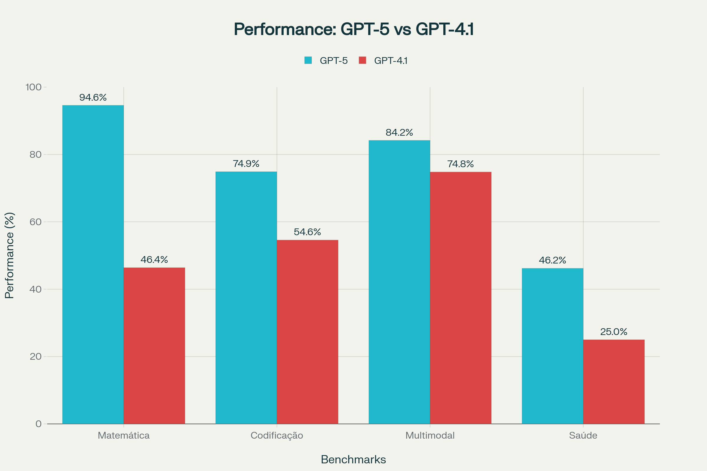

# Novidades do GPT-5

A OpenAI acaba de lançar o **GPT-5**, seu modelo de inteligência artificial mais inteligente, rápido e útil até o momento, marcando um salto significativo em relação às versões anteriores. Este novo modelo representa não apenas uma evolução técnica, mas uma verdadeira revolução na forma como a IA pode ser aplicada em contextos profissionais e cotidianos.[1][2]

## Sistema Unificado e Arquitetura Inteligente
O GPT-5 introduz uma **arquitetura unificada revolucionária** que combina diferentes modelos especializados em um só sistema. Esta abordagem inclui um modelo eficiente para responder perguntas básicas rapidamente, um modelo de raciocínio profundo (GPT-5 thinking) para problemas complexos, e um router em tempo real que decide automaticamente qual modelo usar baseado no tipo de conversa, complexidade e necessidades específicas.[1][3]

O sistema também conta com versões mini que entram em funcionamento quando os limites de uso são atingidos, garantindo continuidade na experiência do usuário. Esta integração inteligente otimiza recursos computacionais e oferece sempre a resposta mais adequada para cada situação.[1]

## Melhorias Substanciais em Áreas-Chave
### Programação e Desenvolvimento
O GPT-5 estabelece novos padrões na área de **codificação**, alcançando **74,9% no SWE-bench Verified** e impressionantes **88% no Aider Polyglot**. As melhorias incluem:[3][4]

- Geração superior de front-end complexo com sensibilidade estética
- Debugging eficiente de repositórios grandes
- Melhor compreensão de espaçamento, tipografia e design
- Capacidade de criar websites, aplicativos e jogos responsivos com apenas um prompt[1][3]

### Escrita Criativa
Como colaborador de escrita, o GPT-5 demonstra **maior profundidade literária e ritmo**, sendo capaz de lidar com ambiguidades estruturais complexas como iambic pentameter não rimado e verso livre natural. Isso se traduz em melhor assistência para tarefas cotidianas como rascunho e edição de relatórios, e-mails e memorandos.[1]

### Aplicações em Saúde
Na área da saúde, o GPT-5 alcança **46,2% no HealthBench Hard**, atuando como um parceiro ativo de pensamento que sinaliza preocupações potenciais e faz perguntas para oferecer respostas mais úteis. O modelo adapta suas respostas ao contexto, nível de conhecimento e geografia do usuário, sempre lembrando que não substitui profissionais médicos.[1]

## Performance e Confiabilidade

### Redução Dramática de Alucinações

Uma das conquistas mais significativas do GPT-5 é a **redução de 45% nos erros factuais** em comparação ao GPT-4o. Quando utilizando o modo thinking, essa redução chega a impressionantes **80% menos erros factuais** que o OpenAI o3, representando um salto qualitativo na confiabilidade das respostas.[1][5]

### Benchmarks Excepcionais
O GPT-5 estabelece novos recordes em diversos benchmarks importantes:
- **Matemática**: 94,6% no AIME 2025 sem ferramentas
- **Raciocínio científico**: 88,4% no GPQA com GPT-5 pro
- **Compreensão multimodal**: 84,2% no MMMU
- **Tarefas agênticas**: 96,7% no τ2-bench telecom[1][3][6]

## Novos Recursos e Personalização
### Personalidades Preset
O GPT-5 introduz **quatro personalidades preset** que permitem aos usuários personalizar como o ChatGPT interage:
- **Cynic (Cínico)**: Para interações mais diretas e céticas
- **Robot (Robô)**: Para respostas concisas e profissionais
- **Listener (Ouvinte)**: Para interações mais empáticas e compreensivas
- **Nerd**: Para discussões mais técnicas e detalhadas[1][7][8]

### Novos Parâmetros da API
Para desenvolvedores, o GPT-5 oferece novos parâmetros de controle:
- **Verbosity**: Controla se as respostas são breves (low), equilibradas (medium) ou detalhadas (high)
- **Reasoning_effort**: Permite ajustar o tempo de raciocínio de minimal a high
- **Custom tools**: Possibilita chamadas de ferramentas com texto simples ao invés de JSON[3]

## GPT-OSS: Democratizando a IA
Paralelamente ao GPT-5, a OpenAI lançou os **modelos GPT-OSS**, marcando o retorno da empresa aos modelos open-weight desde o GPT-2. Esta iniciativa inclui:

### Dois Modelos Complementares
- **gpt-oss-120b**: 117B parâmetros totais com 5,1B ativos, rodando em uma GPU de 80GB
- **gpt-oss-20b**: 21B parâmetros totais com 3,6B ativos, necessitando apenas 16GB de memória[2][9]

### Licença Apache 2.0
Os modelos são disponibilizados sob **licença Apache 2.0**, permitindo uso comercial livre e customização completa, democratizando o acesso a modelos de IA de alta qualidade.[10][2]

## Segurança e Responsabilidade
### Safe Completions
O GPT-5 introduz uma nova abordagem de treinamento de segurança chamada **"safe completions"**, que ensina o modelo a fornecer a resposta mais útil possível mantendo-se dentro dos limites de segurança. Esta abordagem substitui o sistema anterior baseado apenas em recusas categóricas.[1][11]

### Redução de Sycophancy
O modelo demonstra uma **redução significativa na tendência de concordar excessivamente**, diminuindo de 14,5% para menos de 6% em avaliações específicas, resultando em interações mais naturais e menos artificiais.[1]

### Testes Rigorosos
O GPT-5 thinking foi submetido a **5.000 horas de red-teaming** com parceiros como CAISI e UK AISI, sendo classificado como "High capability" no domínio biológico e químico, ativando salvaguardas robustas correspondentes.[12][1]

## Nova Era do Trabalho
### Adoção Empresarial
O lançamento do GPT-5 coincide com um momento de **adoção massiva** por empresas como BNY, California State University, Figma, Intercom, Lowe's, Morgan Stanley, SoftBank e T-Mobile. Atualmente, **5 milhões de usuários pagos** utilizam produtos empresariais do ChatGPT.[4][13]

### Impacto na Produtividade
Com **700 milhões de usuários semanais**, o GPT-5 promete revolucionar a produtividade empresarial através de suas capacidades agênticas aprimoradas, melhor raciocínio e maior confiabilidade.[13][14][4]

## Disponibilidade e Acesso
O GPT-5 está sendo **gradualmente disponibilizado para todos os usuários** do ChatGPT, incluindo usuários gratuitos, embora estes tenham limitações de uso. Usuários Plus têm acesso expandido, enquanto usuários Pro obtêm acesso ilimitado ao GPT-5 e ao GPT-5 Pro.[1][15]

Na API, o modelo está disponível em três versões: **gpt-5, gpt-5-mini e gpt-5-nano**, com preços de $1,25 por milhão de tokens de entrada e $10 por milhão de tokens de saída.[3]

## Conclusão
O GPT-5 representa um marco definitivo na evolução da inteligência artificial, combinando avanços técnicos significativos com uma abordagem mais responsável e acessível. Com melhorias substanciais em confiabilidade, capacidades especializadas e uma nova família de modelos open-source, a OpenAI consolida sua posição de liderança enquanto democratiza o acesso a tecnologias de IA de ponta.

Para profissionais, desenvolvedores e empresas, o GPT-5 oferece ferramentas mais poderosas, confiáveis e personalizáveis, prometendo transformar fundamentalmente como interagimos com a inteligência artificial no trabalho e na vida cotidiana.

## Fontes:
- [1] https://openai.com/index/introducing-gpt-5/
- [2] https://openai.com/index/introducing-gpt-oss/
- [3] https://openai.com/index/introducing-gpt-5-f
- [4] https://arxiv.org/abs/2408.01800
- [5] https://www.vellum.ai/blog/gpt-5-benchmarks
- [6] https://openai.com/index/introducing-gpt-5-for-developers/
- [7] https://x.com/OpenAI/status/1953534071772262511
- [8] https://x.com/TheZvi/status/1953544358894219689
- [9] https://github.com/openai/gpt-oss
- [10] https://huggingface.co/blog/welcome-openai-gpt-oss
- [11] https://openai.com/pt-BR/index/gpt-5-safe-completions/
- [12] http://medrxiv.org/lookup/doi/10.1101/2024.06.10.24308699
- [13] https://openai.com/pt-BR/index/gpt-5-new-era-of-work/
- [14] https://www.correiodopovo.com.br/jornal-com-tecnologia/open-ai-lan%C3%A7a-chat-gpt-5-a-nova-era-do-trabalho-1.1635240
- [15] https://exame.com/inteligencia-artificial/openai-lanca-gpt-5-com-versao-gratuita-e-promete-modelo-mais-util-e-preciso/
- [16] https://arxiv.org/abs/2310.16534
- [17] https://link.springer.com/10.1007/s11695-023-06576-5
- [18] https://arxiv.org/abs/2410.17736
- [19] https://onlinelibrary.wiley.com/doi/10.1111/exsy.13243
- [20] https://arxiv.org/abs/2311.15732
- [21] http://medrxiv.org/lookup/doi/10.1101/2024.07.27.24310809
- [22] https://www.semanticscholar.org/paper/ced381535f8b8c8570a2bdf178a3c93a5339b189
- [23] https://dl.acm.org/doi/10.1145/3568812.3603476
- [24] http://arxiv.org/pdf/2405.10299.pdf
- [25] https://arxiv.org/pdf/2309.08448.pdf
- [26] https://arxiv.org/pdf/2306.17156.pdf
- [27] http://arxiv.org/pdf/2403.11807v1.pdf
- [28] https://arxiv.org/pdf/2305.14982.pdf
- [29] http://arxiv.org/pdf/2410.04199.pdf
- [30] http://arxiv.org/pdf/2306.05524.pdf
- [31] http://arxiv.org/pdf/2406.04770.pdf
- [32] https://arxiv.org/pdf/2109.07958.pdf
- [33] https://arxiv.org/pdf/2305.18365.pdf
- [34] https://www.reddit.com/r/singularity/comments/1mk621a/gpt5_benchmarks_on_the_artificial_analysis/?tl=pt-br
- [35] https://cdn.openai.com/pdf/8124a3ce-ab78-4f06-96eb-49ea29ffb52f/gpt5-system-card-aug7.pdf
- [36] https://every.to/vibe-check/gpt-5
- [37] https://undetectable.ai/blog/br/gpt-4-5/
- [38] https://g1.globo.com/tecnologia/noticia/2025/08/07/gpt-5-nova-geracao-do-chatgpt-promete-ser-mais-humana-e-com-menos-alucinacoes.ghtml
- [39] https://www.jornalopcao.com.br/ultimas-noticias/atualizado-chatgpt-5-tera-conversas-mais-humanas-e-menos-alucinacoes-732433/
- [40] https://artificialanalysis.ai/models/gpt-5-medium
- [41] https://meetcody.ai/pt-br/blog/gpt-4-5-vs-claude-3-7-sonnet-um-mergulho-profundo-nos-avancos-da-ia/
- [42] https://www.infomoney.com.br/business/openai-lanca-modelo-gpt-5-mais-poderoso-para-programacao-e-escrita/
- [43] https://canaltech.com.br/inteligencia-artificial/com-a-estreia-do-gpt-5-chatgpt-perdera-o-gpt-4o-o3-e-outros-modelos-entenda/
- [44] https://x.com/ArtificialAnlys/status/1953507703105757293
- [45] https://botpress.com/pt/blog/everything-you-should-know-about-gpt-5
- [46] https://canaltech.com.br/inteligencia-artificial/vazam-detalhes-do-gpt-5-modelo-tera-quatro-versoes-diferentes/
- [47] https://olhardigital.com.br/2025/08/07/pro/ele-chegou-openai-anuncia-o-gpt-5-seu-novo-modelo-superpoderoso/
- [48] https://www.wired.com/story/openais-gpt-5-is-here/
- [49] https://www.reddit.com/r/ChatGPTCoding/comments/1crp1pu/is_gpt4o_better_for_coding_than_regular_gpt4/?tl=pt-br
- [50] https://diariodocomercio.com.br/mix/chatgpt-recebe-atualizacao-veja-todas-as-novidades/
- [51] https://portalderevistas.esags.edu.br/index.php/revista/article/view/119
- [52] https://www.apm.org.br/wp-content/uploads/SPMJ_v140_Suppl1_CORRETA.pdf
- [53] https://ojs.studiespublicacoes.com.br/ojs/index.php/cadped/article/view/9933
- [54] https://studiespublicacoes.com.br/ojs/index.php/sssr/article/view/558
- [55] https://www.semanticscholar.org/paper/c1d2f70db96fb4ecf44589a59017c00957edcc5c
- [56] https://www.semanticscholar.org/paper/5dc8372d2a50dec722c59b44df84d61eb02b1068
- [57] http://www.scielo.br/scielo.php?script=sci_arttext&pid=S1414-49802022000100001&tlng=pt
- [58] https://ojs.observatoriolatinoamericano.com/ojs/index.php/olel/article/view/2514
- [59] https://ebooks.marilia.unesp.br/index.php/lab_editorial/catalog/book/205
- [60] https://revistarelacionespublicas.uma.es/index.php/revrrpp/article/view/657
- [61] https://www.scielo.br/j/rae/a/X5pJthCTsRGHxhmqxmKq6Ww/?format=pdf&lang=pt
- [62] https://revistaacademicaonline.ojsbrasil.com.br/index.php/rao/article/download/108/218
- [63] https://periodicorease.pro.br/rease/article/download/16550/9119
- [64] https://revistas.pucsp.br/index.php/pontoevirgula/article/download/51033/34403
- [65] https://www.scielo.br/j/rae/a/vpBmThDT7Prh657SzxmKxNb/?format=pdf&lang=pt
- [66] https://www.scielo.br/j/cebape/a/FHBLtCcQndXVLGSZhQqnmWn/?format=pdf&lang=pt
- [67] http://www.scielo.br/scielo.php?script=sci_arttext&pid=S0100-19652002000100008&lng=pt&tlng=pt
- [68] https://noticias.uol.com.br/ultimas-noticias/afp/2025/08/07/openai-lanca-o-chatgpt-5-seu-novo-modelo-de-ia-generativa.htm
- [69] https://www.datahackers.news/p/o-que-esperar-do-lan-amento-do-gpt-5-entenda-como-ele-pode-mudar-a-an-lise-de-dados-832c
- [70] https://www.agenciamestre.com/inteligencia-artificial/gpt-5-openai/
- [71] https://www.uol.com.br/tilt/noticias/reuters/2025/08/07/openai-do-chatgpt-lanca-gpt-5.htm
- [72] https://distrito.me/blog/gpt-oss-conheca-novos-modelos-open-weight-da-openai/
- [73] https://techcrunch.com/2025/08/07/openais-gpt-5-is-here/
- [74] https://openai.com/pt-BR/news/product-releases/
- [75] https://www.edivaldobrito.com.br/gpt-5-chega-com-melhorias-significativas-em-inteligencia-artificial/