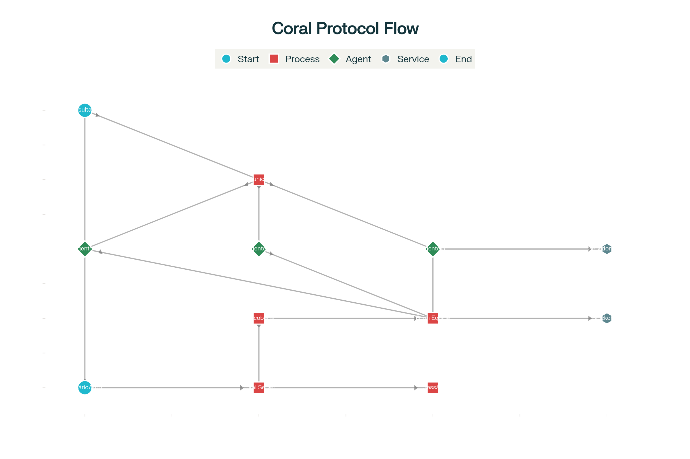
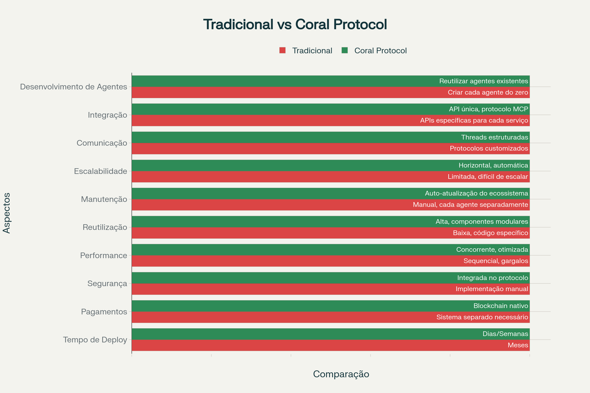

# Protocolo de Agentes Coral: Tutorial Completo e Guia de Implementação

O **Coral Protocol** representa uma revolução na infraestrutura de colaboração entre agentes de inteligência artificial, oferecendo uma abordagem descentralizada e padronizada para sistemas multi-agente. Este protocolo permite que desenvolvedores criem, integrem e orquestrem múltiplos agentes especializados de forma eficiente, segura e escalável, estabelecendo as bases para uma verdadeira "Internet de Agentes".


Ilustração conceitual do Coral Protocol conectando agentes de IA

## O que é o Coral Protocol

O Coral Protocol é uma **infraestrutura aberta e descentralizada** que permite comunicação, coordenação, confiança e pagamentos entre agentes de IA[1][2]. Diferentemente das abordagens tradicionais que exigem desenvolvimento customizado para cada integração, o Coral oferece um conjunto padronizado de serviços que qualquer agente pode utilizar, independentemente do framework ou linguagem de desenvolvimento[3][4].

### Características Principais

O protocolo se destaca por suas **capacidades integradas** que incluem mediação estruturada de interações, descoberta dinâmica de agentes, formação segura de equipes, integração modular de ferramentas e transações econômicas nativas[1]. Esta abordagem holística diferencia o Coral de protocolos predecessores que focavam apenas em aspectos isolados da colaboração entre agentes[1].

## Arquitetura e Componentes Fundamentais

### Coral Server

O **Coral Server** atua como o núcleo do sistema, implementando os serviços centrais do protocolo[1]. Ele gerencia a mediação de interações, roteamento de mensagens, gerenciamento de tarefas e coordenação de trabalho multi-agente seguro[1]. O servidor funciona como um ambiente de tempo de execução backend que cria instâncias de agentes conectadas a servidores MCP individualizados[3].

### Agentes Coralizados

Os **Agentes Coralizados** são serviços de IA que aderem aos protocolos do Coral, tipicamente suportados por LLMs ou ferramentas especializadas[1]. Cada agente pode entender linguagem natural e comunicar-se com outros agentes através do framework estruturado do protocolo[1]. O processo de "Coralização" permite integrar agentes existentes ou criar novos usando módulos Coralizer[1].

### Servidores MCP e Ferramentas

O protocolo utiliza o **Model Context Protocol (MCP)** para fornecer endpoints de computação e integração[1]. Os servidores MCP permitem que agentes acessem ferramentas externas, serviços e modelos de forma padronizada, incluindo componentes de "carteira" para transações econômicas seguras[1].



Fluxograma do Protocolo Coral - Sistema Multi-Agente

### Sistema de Comunicação Baseado em Threads

O Coral implementa um sistema sofisticado de **comunicação por threads** que organiza conversas de forma contextual e eficiente[1]. Os agentes podem criar threads, adicionar participantes, enviar mensagens e aguardar menções específicas, eliminando a necessidade de polling contínuo[1].

### Camada Blockchain

A **camada blockchain** fornece um livro-razão imutável para eventos importantes, transferências de pagamento seguras, acordos entre agentes e pontos de verificação de execução[1]. Essa infraestrutura garante transparência, auditabilidade e execução de contratos inteligentes para pagamentos condicionais[1].

## Tutorial Prático: Configurando seu Primeiro Sistema Multi-Agente

### Pré-requisitos

Para começar com o Coral Protocol, você precisará das seguintes ferramentas instaladas[3]:


| Ferramenta  | Versão | Finalidade                      |
|:------------|:-------|:--------------------------------|
| **Python**  | 3.10+  | Execução da maioria dos agentes |
| **Node.js** | 18+    | Coral Studio UI                 |
| **Java**    | 17+    | Coral Server                    |
| **Git**     | Latest | Clonagem de repositórios        |
| **Yarn**    | Latest | Gerenciamento de dependências   |

### Passo 1: Configuração do Coral Studio

O **Coral Studio** é a interface web para gerenciar sessões e agentes visualmente[3]:

```bash
git clone https://github.com/Coral-Protocol/coral-studio.git
cd coral-studio
yarn install
yarn dev
```

A interface estará disponível em `http://localhost:3000`[3].

### Passo 2: Instalação do Coral Server

O servidor backend processa sessões multi-agente[3]:

```bash
git clone https://github.com/Coral-Protocol/coral-server.git
cd coral-server
./gradlew run
```

**Nota importante**: O Gradle pode parecer "travado" em 86%, mas o servidor estará executando quando aparecerem mensagens nos logs[3].

### Passo 3: Configuração de Agentes

O arquivo `application.yaml` define os agentes disponíveis no sistema[3]. Aqui está um exemplo de configuração:

```yaml

# Exemplo de configuração application.yaml para Coral Protocol
# Este arquivo define os agentes disponíveis no sistema

applications:
  - id: "meu-app"
    name: "Sistema Multi-Agente Blog"
    description: "Aplicação para demonstração em blog"
    privacyKeys:
      - "default-key"
      - "public"

registry:
  # Agente de Interface - Coordena outros agentes
  interface_agent:
    options:
      - name: "API_KEY"
        type: "string"  
        description: "Chave da API do OpenAI"
    runtime:
      type: "executable"
      command: ["bash", "-c", "${PROJECT_DIR}/interface-agent/run.sh"]
      environment:
        - name: "API_KEY"
          from: "API_KEY"
        - name: "MODEL_NAME"
          value: "gpt-4"
        - name: "MODEL_PROVIDER" 
          value: "openai"

  # Agente de Pesquisa - Busca informações na web
  research_agent:
    options:
      - name: "OPENAI_API_KEY"
        type: "string"
        description: "Chave da API do OpenAI"
      - name: "SEARCH_API_KEY"
        type: "string" 
        description: "Chave da API de busca"
    runtime:
      type: "executable"
      command: ["bash", "-c", "${PROJECT_DIR}/research-agent/run.sh"]
      environment:
        - name: "OPENAI_API_KEY"
          from: "OPENAI_API_KEY"
        - name: "SEARCH_API_KEY"
          from: "SEARCH_API_KEY"

  # Agente de Análise de Repositório - Entende código GitHub
  repo_agent:
    options:
      - name: "GITHUB_TOKEN"
        type: "string"
        description: "Token de acesso do GitHub"
      - name: "API_KEY"
        type: "string"
        description: "Chave da API do modelo"
    runtime:
      type: "executable" 
      command: ["bash", "-c", "${PROJECT_DIR}/repo-agent/run.sh"]
      environment:
        - name: "GITHUB_TOKEN"
          from: "GITHUB_TOKEN"
        - name: "API_KEY"
          from: "API_KEY"

```

### Passo 4: Seleção e Setup de Agentes

O Coral Protocol oferece uma **biblioteca de agentes open-source** reutilizáveis[3][5]. Exemplos populares incluem:

- **Interface Agent**: Coordena ações entre outros agentes
- **Deep Research Agent**: Realiza pesquisas detalhadas usando LLM + ferramentas
- **Repository Understanding Agent**: Analisa repositórios GitHub usando LangChain

Cada agente requer seu próprio script de execução[3]:

```bash
#!/bin/bash
# Script de exemplo para executar um agente Coral

# Configurar ambiente virtual Python
python3 -m venv coral-env
source coral-env/bin/activate

# Instalar dependências
pip install -r requirements.txt

# Executar o agente
python main.py

```

### Passo 5: Criação de Sessões

Após configurar os agentes, você pode criar sessões através do Coral Studio ou APIs REST[3]. O sistema permite:

- Gerenciar sessões de agentes usando a interface
- Rotear mensagens entre agentes usando threads estruturadas
- Personalizar e expandir o ecossistema de agentes conforme necessário[3]


## Exemplos Práticos de Uso

### Sistema de Teste de Software Inteligente

Um exemplo real implementado mostra como o protocolo pode orquestrar múltiplos agentes para testes automatizados[1]. O sistema inclui:

- **Agente de Clonagem Git**: Clona repositórios usando CrewAI
- **Agente de Revisão de Código**: Analisa diferenças usando CAMEL-AI
- **Agente de Execução de Testes**: Roda testes unitários usando LangChain
- **Agente de Consistência**: Verifica documentação usando múltiplos frameworks[6]


### Sistema de Análise Financeira

O protocolo foi demonstrado em sistemas de consultoria financeira pessoal que integra com APIs bancárias (como Monzo) para fornecer análises seguras e preservação de privacidade usando LLMs locais[7].

## Vantagens Competitivas



Comparação: Desenvolvimento Tradicional vs Coral Protocol

O Coral Protocol oferece benefícios significativos sobre abordagens tradicionais:

### Eficiência e Performance

O sistema permite **execução concorrente** de múltiplos agentes, aumentando significativamente a responsividade comparado a frameworks sequenciais baseados em Python[3]. Resultados recentes mostram que o sistema superou o Magnetic-UI da Microsoft em 34% no benchmark GAIA[8][9].

### Escalabilidade Horizontal

Ao invés de aumentar parâmetros de modelos individuais, o Coral implementa **escalonamento horizontal** através da orquestração inteligente de modelos menores e especializados[8][9]. Esta abordagem demonstrou que modelos menores bem coordenados podem rivalizar ou superar sistemas de grande escala[9].

### Interoperabilidade

O protocolo é **agnóstico a frameworks e linguagens**, permitindo que desenvolvedores usem qualquer tecnologia para construir ou trabalhar com agentes[3][4]. Esta flexibilidade elimina vendor lock-in e facilita a integração de sistemas existentes.

## Aplicações em Diversos Setores

### Desenvolvimento de Software

Sistemas automatizados de teste, revisão de código, e análise de repositórios demonstram o potencial para transformar workflows de desenvolvimento[1][6].

### Serviços Financeiros

Aplicações de consultoria financeira pessoal e análise de dados bancários mostram casos de uso em fintech[7].

### Pesquisa e Análise

Agentes especializados em pesquisa profunda e agregação de informações oferecem capacidades avançadas de business intelligence[3][5].

## Segurança e Pagamentos

### Formação Segura de Equipes

O protocolo implementa **capacidades avançadas de formação de equipes** que montam dinamicamente grupos de agentes com identidades verificadas, permissões controladas e pontuações de confiança auditáveis[1].

### Sistema de Pagamentos Blockchain

A infraestrutura nativa de pagamentos permite **micropagamentos autônomos** entre agentes, criando um marketplace incentivado onde desenvolvedores são recompensados quando seus agentes são utilizados[1][10].

## Roadmap e Futuro

O Coral Protocol está posicionado como um protocolo fundamental para a **"Internet de Agentes"** emergente[1]. O roadmap inclui melhorias em gerenciamento de risco, auditoria de segurança, e expansão das capacidades de colaboração entre agentes[1].

### Impacto no Desenvolvimento

O protocolo promete transformar fundamentalmente como software é desenvolvido, movendo de uma abordagem de "construir tudo do zero" para uma de **composição de componentes inteligentes**[11]. Esta mudança paradigmática pode acelerar significativamente o tempo de desenvolvimento e melhorar a qualidade dos sistemas resultantes.

## Conclusão

O Coral Protocol representa um avanço significativo na infraestrutura de sistemas multi-agente, oferecendo uma solução completa para os desafios de interoperabilidade, escalabilidade e segurança. Com sua abordagem descentralizada, padronizada e economicamente incentivada, o protocolo está bem posicionado para catalisar a emergência de um ecossistema vibrante de agentes inteligentes colaborativos.

Para desenvolvedores interessados em implementar sistemas multi-agente, o Coral Protocol oferece uma alternativa convincente às abordagens tradicionais, prometendo desenvolvimento mais rápido, melhor performance e maior flexibilidade. A combinação de recursos técnicos avançados com exemplos práticos demonstrados torna o protocolo uma ferramenta valiosa para a próxima geração de aplicações de inteligência artificial.

## Fontes:

- [1] https://arxiv.org/html/2505.00749v1
- [2] https://arxiv.org/html/2505.00749v2
- [3] https://github.com/Coral-Protocol/build-agentic-software-w-coral-os-agents
- [4] https://lablab.ai/tech/coral-protocol
- [5] https://github.com/Coral-Protocol/awesome-agents-for-multi-agent-systems
- [6] https://docs.coralprotocol.org/CoralDoc/Examples/software-testing
- [7] https://github.com/Coral-Protocol/Coral-RaiseYourHack-QualcomnTrackExample
- [8] https://mpost.io/pt/coral-protocol-outperforms-microsoft-by-34-with-top-gaia-benchmark-for-ai-mini-model/
- [9] https://hackernoon.com/how-coral-protocol-proved-small-models-can-outperform-big-techs-ai-systems
- [10] https://coinmarketcap.com/currencies/coral-protocol/
- [11] https://www.youtube.com/watch?v=PET-4Cghcm8
- [12] https://www.gov.br/icmbio/pt-br/assuntos/noticias/ultimas-noticias/manejo-do-coral-sol-e-realizado-na-rebio-marinha-do-arvoredo
- [13] https://antigo.mctic.gov.br/mctic/export/sites/institucional/arquivos/ASCOM_PUBLICACOES/coral_sol.pdf
- [14] https://www.rootdata.com/Projects/detail/Coral Protocol?k=MTY5OTE%3D
- [15] https://cdn.campogrande.ms.gov.br/portal/prod/uploads/sites/30/2020/11/PROTOCOLO-ACS-PARA-CONSULTA-PUBLICA.pdf
- [16] https://www.youtube.com/watch?v=UY6rywlNOs0
- [17] https://www.coralprotocol.org
- [18] https://www.sciencedirect.com/science/article/abs/pii/S1389128624004523
- [19] https://arxiv.org/abs/2505.00749
- [20] https://x.com/coralprotocol
- [21] https://bvsms.saude.gov.br/bvs/publicacoes/manual_protecao_agentes_endemias.pdf
- [22] https://docs.coralprotocol.org/CoralDoc/Introduction/WhatisCoralProtocol
- [23] https://www.forbes.com/digital-assets/assets/coral-protocol-coral/
- [24] https://coralvivo.org.br/wp-content/uploads/2022/07/Manual-Conduta-Consciente-Em-Recifes_V2.pdf
- [25] https://indico.cern.ch/event/38665/attachments/772118/1058909/Coral_Server_Software_Design_Description.pdf
- [26] https://github.com/Coral-Protocol/existing-agent-sessions-tutorial-private-temp
- [27] https://arxiv.org/html/2507.16941v1
- [28] https://www.mitrade.com/insights/news/live-news/article-3-1021248-20250807
- [29] https://github.com/Coral-Protocol/coral-server
- [30] https://www.youtube.com/watch?v=gh4alMRsgKY
- [31] https://www.linkedin.com/posts/coralprotocol_coral-protocol-changes-how-you-build-multi-agent-activity-7338532558109855747-mi8R
- [32] https://23turtles.mintlify.app/CoralDoc/Quickstart/Runcoralserver
- [33] https://x.com/coral_protocol
- [34] https://www.ibm.com/br-pt/think/topics/multiagent-system
- [35] https://botpress.com/pt/blog/multi-agent-systems
- [36] http://www.arxiv.org/pdf/2505.00749v2.pdf
- [37] https://www.youtube.com/watch?v=tpHeSTSajCw
- [38] https://sol.sbc.org.br/index.php/wesaac/article/download/33442/33237/
- [39] https://github.com/orgs/Coral-Protocol/repositories
- [40] https://www.pucrs.br/facin-prov/wp-content/uploads/sites/19/2016/03/tr014.pdf
- [41] https://coral-erm.org/wp-content/uploads/2022/05/CORAL-Online-Summit-Resources-Module-and-Workflows_Song.pdf
- [42] https://distrito.me/blog/sistemas-multiagentes-o-que-e-como-funciona-e-importancia/
- [43] https://www.pipefy.com/pt-br/blog/diagrama-workflow/
- [44] https://www.feis.unesp.br/Home/departamentos/engenhariaeletrica/lapsee/2010_diss_joel_david_melo_trujillo.pdf
- [45] https://repositorio.ufsc.br/bitstream/handle/123456789/186630/MAA - Mauro Roisenberg.pdf?sequence=1\&isAllowed=y
- [46] https://coralsistemas.com/funcionalidades/
- [47] http://www.inf.ufsc.br/~alvares/INE5633/SistemasMultiagentes.pdf
- [48] https://ppl-ai-code-interpreter-files.s3.amazonaws.com/web/direct-files/c7ef393d8577fef4615dd17819e3a500/168a2161-986f-4fa6-8bfd-ce2942822548/682b14de.csv
- [49] https://ppl-ai-code-interpreter-files.s3.amazonaws.com/web/direct-files/c7ef393d8577fef4615dd17819e3a500/4b2ff637-3a36-4338-945d-2501ef5aecf1/0ac05d6a.yaml
- [50] https://ppl-ai-code-interpreter-files.s3.amazonaws.com/web/direct-files/c7ef393d8577fef4615dd17819e3a500/4b2ff637-3a36-4338-945d-2501ef5aecf1/63566ab9.sh

