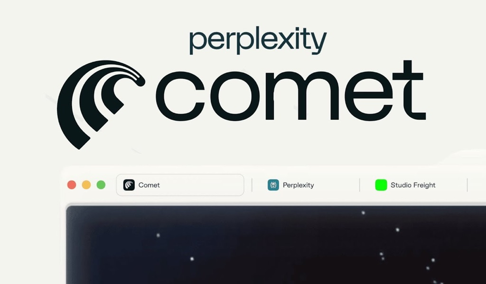
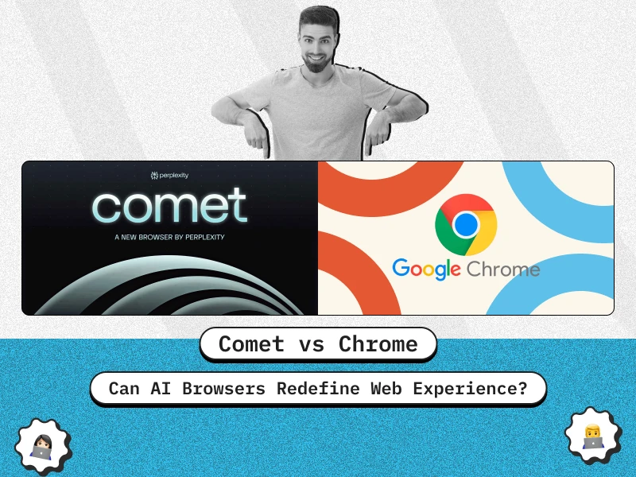

# Comet: O Navegador Revolucionário da Perplexity que Promete Transformar Como Navegamos na Web

A **Perplexity AI** acaba de lançar uma das inovações mais aguardadas do mundo tech: o **navegador Comet**, uma ferramenta que promete revolucionar completamente nossa experiência na internet. Diferente dos navegadores tradicionais, o Comet integra inteligência artificial de forma nativa, transformando cada sessão de navegação em uma experiência personalizada e inteligente.[^1_1][^1_2][^1_3][^1_4]

Logo and interface elements of the Comet browser by Perplexity, illustrating its branding and browser tab design.

## O Que Torna o Comet Especial?

O Comet não é apenas mais um navegador com alguns recursos de IA adicionados. Ele foi **construído desde o zero com a inteligência artificial como seu núcleo**. Baseado no Chromium, o navegador da Perplexity oferece compatibilidade total com os padrões web atuais, mas vai muito além das funcionalidades convencionais.[^1_3][^1_4][^1_5]

### Navegação Agêntica: O Futuro Chegou

O grande diferencial do Comet está na chamada **"navegação agêntica"**. Isso significa que o navegador não apenas responde às suas perguntas, mas pode efetivamente **executar tarefas por você**. Imagine poder dizer "reserve um hotel em Paris para o próximo fim de semana" e ver o navegador fazer todo o trabalho automaticamente.[^1_6][^1_7][^1_8]

Comparison of AI-powered Comet browser and Google Chrome with a focus on redefining web experience.

## Comet Assistant: Seu Parceiro Digital Inteligente

### Funcionalidades do Assistente

O **Comet Assistant** é o coração do navegador, oferecendo funcionalidades impressionantes:[^1_2][^1_3][^1_9]

- **Resumo automático de conteúdo**: Analisa páginas web e fornece resumos instantâneos
- **Automação de tarefas**: Pode enviar e-mails, agendar reuniões e gerenciar sua agenda[^1_3][^1_2]
- **Análise contextual**: Entende o conteúdo de qualquer página e responde perguntas específicas[^1_4][^1_10]
- **Gestão de abas inteligente**: Organiza e compara informações entre diferentes abas abertas[^1_7][^1_11]
- **Automação de compras**: Pode adicionar produtos ao carrinho e até finalizar compras[^1_7]

### Como Funciona na Prática

O assistente aparece em uma **barra lateral** que pode ser ativada em qualquer página web. Você pode fazer perguntas sobre o conteúdo que está vendo, pedir comparações de produtos, ou até mesmo solicitar ações mais complexas como cancelar assinaturas de e-mail.[^1_7][^1_10][^1_12]

Comet AI browser showcasing news article summarization and smart document handling features.

## Recursos Inovadores que Impressionam

### Busca Integrada com IA

O Comet usa o **mecanismo de busca da Perplexity como padrão**, fornecendo respostas diretas e contextualizadas em vez de apenas uma lista de links. Isso significa que você obtém informações precisas imediatamente, sem precisar visitar múltiplos sites.[^1_2][^1_3][^1_12]

### Automação de Workflow

Uma das funcionalidades mais impressionantes é a capacidade de **automatizar fluxos de trabalho complexos**:[^1_5][^1_8]

- Análise automática de inbox e preparação para reuniões[^1_13]
- Agrupamento inteligente de abas por projeto[^1_5]
- Automação de notas e organização de conteúdo[^1_13]
- Execução de tarefas em background enquanto você foca em outras atividades[^1_7]

### Aprendizado Personalizado

O Comet **aprende como você pensa e trabalha**, adaptando-se ao seu estilo e preferências ao longo do tempo. Isso permite que o navegador antecipe suas necessidades e ofereça sugestões cada vez mais relevantes.[^1_1][^1_5]

## Preço e Disponibilidade: O Elefante na Sala

Aqui chegamos ao ponto mais controverso: o **preço**. Atualmente, o Comet está disponível apenas para assinantes do **Perplexity Max**, que custa **US\$ 200 por mês** (aproximadamente **R\$ 1.100** na cotação atual).[^1_2][^1_14][^1_15][^1_16]

### Por Que Esse Preço?

O valor elevado se justifica pelo acesso a:

- Modelos avançados de IA (GPT-4o, Claude, Mistral, Gemini)[^1_16]
- Processamento computacional intensivo para IA[^1_14]
- Recursos de automação empresarial[^1_16]
- Acesso antecipado a novas funcionalidades[^1_17]

### Planos de Expansão

A Perplexity já sinalizou que pretende lançar **versões mais acessíveis** no futuro, possivelmente com modelo freemium. Por enquanto, alguns usuários podem acessar através de convites limitados da lista de espera.[^1_4][^1_12][^1_15][^1_18]

## Comparação com a Concorrência

### Comet vs. Google Chrome

A comparison image showing Comet browser and Google Chrome logos with text indicating a trial of both browsers.

| Aspecto | Comet | Chrome |
| :-- | :-- | :-- |
| **IA Nativa** | Integrada desde o core | Recursos adicionais (Gemini) |
| **Automação** | Execução completa de tarefas | Limitada a sugestões |
| **Busca** | Perplexity integrado | Google Search |
| **Preço** | US\$ 200/mês | Gratuito |
| **Disponibilidade** | Windows/Mac apenas | Multiplataforma |

### Outros Concorrentes

O Comet não está sozinho na corrida dos **navegadores com IA**. A The Browser Company está desenvolvendo o **Dia**, e há rumores de que a **OpenAI também planeja lançar seu próprio navegador**. Até mesmo a Opera anunciou ferramentas de IA para seu navegador.[^1_12][^1_14][^1_19][^1_20]

## Vantagens e Limitações

### Principais Vantagens

- ✅ **Integração nativa de IA** mais avançada do mercado
- ✅ **Automação real de tarefas**, não apenas sugestões
- ✅ **Interface familiar** baseada em Chromium
- ✅ **Aprendizado personalizado** contínuo
- ✅ **Resumos instantâneos** de qualquer conteúdo web

### Limitações Atuais

- ❌ **Preço extremamente alto** para usuários individuais
- ❌ **Disponibilidade limitada** (apenas Windows/Mac)
- ❌ **Falhas ocasionais** em tarefas mais complexas[^1_7]
- ❌ **Dependência de conexão** para funcionalidades de IA
- ❌ **Questões de privacidade** com coleta extensiva de dados[^1_21]

## O Futuro da Navegação Web

O Comet representa uma **mudança paradigmática** na forma como interagimos com a internet. Ao invés de simplesmente "navegar" por páginas, estamos caminhando para uma era onde o navegador se torna um **assistente inteligente proativo**.[^1_5][^1_6]

### Impacto no Mercado

A entrada da Perplexity no mercado de navegadores intensifica a competição com o Google Chrome, especialmente considerando que a empresa expressou interesse em **adquirir o Chrome** caso o Google seja forçado a vendê-lo devido a questões antitruste.[^1_11][^1_22]

### Tendências Futuras

O sucesso do Comet pode acelerar a adoção de recursos de IA em outros navegadores e inspirar uma nova geração de ferramentas web mais inteligentes e automatizadas.[^1_5][^1_8]

## Vale a Pena Experimentar?

O **navegador Comet** definitivamente representa o futuro da navegação web. Para **profissionais que dependem heavily de automação e pesquisa**, o investimento pode se justificar pela economia de tempo e aumento de produtividade.[^1_16]

Para **usuários casuais**, faz sentido aguardar versões mais acessíveis que certamente chegarão ao mercado. A tecnologia é impressionante, mas o preço atual limita seu alcance.

### Recomendação

Se você é **early adopter**, trabalha com pesquisa intensiva ou gerencia múltiplos projetos digitais, o Comet pode ser um investimento valioso. Para outros casos, aguardar a democratização dessa tecnologia é a estratégia mais sensata.

## Conclusão: Uma Visão do Amanhã

O **Comet da Perplexity** nos oferece uma janela fascinante para o futuro da web. Embora ainda tenha limitações de preço e disponibilidade, representa um salto evolutivo significativo na forma como navegadores podem nos assistir no dia a dia.[^1_1][^1_4]

A verdadeira revolução acontecerá quando essa tecnologia se tornar mais acessível, permitindo que milhões de usuários experimentem uma web que trabalha **para eles**, ao invés de contra eles. O Comet é apenas o começo dessa jornada empolgante rumo à navegação verdadeiramente inteligente.

**E você, está pronto para navegar na velocidade do pensamento?**

***
 
*Para mais informações sobre tecnologia e inovação, continue acompanhando nosso blog. O futuro da web está apenas começando!*

[^1_1]: https://www.perplexity.ai/comet/

[^1_2]: https://www.youtube.com/watch?v=r5ILfas8a34

[^1_3]: https://www.reddit.com/r/browsers/comments/1ixdjvd/one_more_browser_for_our_list_comet_by_perplexity/?tl=pt-br

[^1_4]: https://latenode.com/pt-br/blog/comet-browser-ai-fix

[^1_5]: https://meetcody.ai/pt-br/blog/perplexity-comet-um-salto-ousado-para-a-pesquisa-agentica/

[^1_6]: https://techcrunch.com/2025/07/09/perplexity-launches-comet-an-ai-powered-web-browser/

[^1_7]: https://translate.google.com/translate?u=https%3A%2F%2Ftechcrunch.com%2F2025%2F07%2F09%2Fperplexity-launches-comet-an-ai-powered-web-browser%2F\&hl=pt\&sl=en\&tl=pt\&client=srp

[^1_8]: https://apidog.com/pt/blog/what-is-comet-pt/

[^1_9]: https://olhardigital.com.br/2025/07/09/internet-e-redes-sociais/perplexity-entra-no-mundo-dos-navegadores-com-o-comet-conheca/

[^1_10]: https://www.theverge.com/news/709025/perplexity-comet-ai-browser-chrome-competitor

[^1_11]: https://translate.google.com/translate?u=https%3A%2F%2Fwww.perplexity.ai%2Fhub%2Fblog%2Fintroducing-comet\&hl=pt\&sl=en\&tl=pt\&client=srp

[^1_12]: https://www.aprendizartificial.com/comet-o-navegador-da-web-com-ia-que-rivaliza-com-o-google/

[^1_13]: https://tecnoblog.net/noticias/perplexity-anuncia-navegador-comet-com-ia-para-buscas/

[^1_14]: https://revistaoeste.com/tecnologia/um-novo-browser-no-mercado-comet/

[^1_15]: https://translate.google.com/translate?u=https%3A%2F%2Fwww.comet.com%2F\&hl=pt\&sl=en\&tl=pt\&client=srp

[^1_16]: https://blog.joinads.me/ia-privacidade-e-monetizacao-o-impacto-do-navegador-comet-e-a-remocao-do-deepseek/

[^1_17]: https://www.instagram.com/p/DMzwhSqtAF7/

[^1_18]: https://efficient.app/apps/comet

[^1_19]: https://tecnoblog.net/noticias/navegador-da-perplexity-vai-rastrear-tudo-que-voce-faz/

[^1_20]: https://www.youtube.com/watch?v=uMTkpu7b2Yk

[^1_21]: https://www.perplexity.ai/comet/gettingstarted

[^1_22]: https://www.perplexity.ai/hub/blog/introducing-comet

[^1_23]: https://mashable.com/article/perplexity-ai-browser-comet-features-to-try

[^1_24]: https://aidrops.com.br/2025/07/10/comet-conheca-o-navegador-com-ia-da-perplexity/

[^1_25]: https://canaltech.com.br/software/preco-mensal-do-navegador-com-ia-da-perplexity-vai-deixar-voce-perplexo/

[^1_26]: https://fortune.com/2025/08/13/perplexity-chrome-acquisition-bid-comet-ai-browser-next-google/

[^1_27]: https://portaltela.com/entretenimento/tecnologia/2025/07/09/novo-navegador-promete-competir-com-chrome-por-apenas-r-1-mil-com-tecnologia-ia

[^1_28]: https://sempreupdate.com.br/navegador-com-ia-perplexity-comet/

[^1_29]: https://www.perplexity.ai/hub/blog/introducing-perplexity-max

[^1_30]: https://www.robertodiasduarte.com.br/comet-navegador-com-ia-da-perplexity-que-revoluciona-a-busca-online/

[^1_31]: https://programae.org.br/noticiastecnologia/noticias/218/

