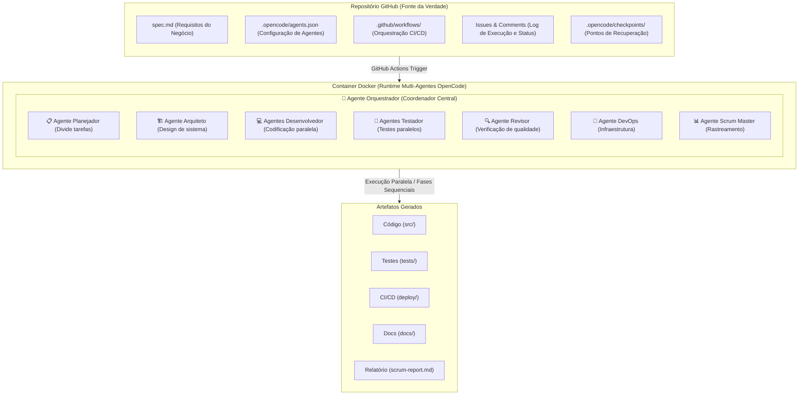
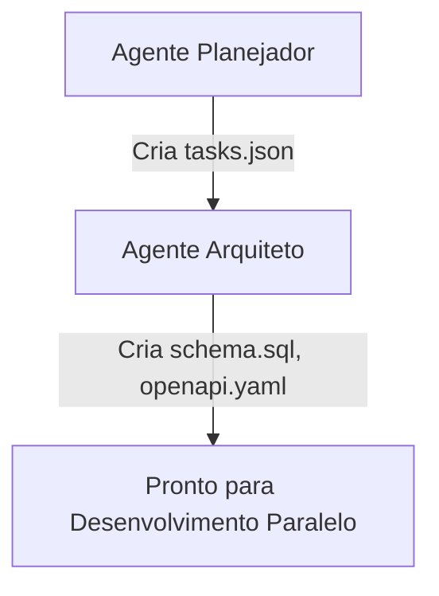
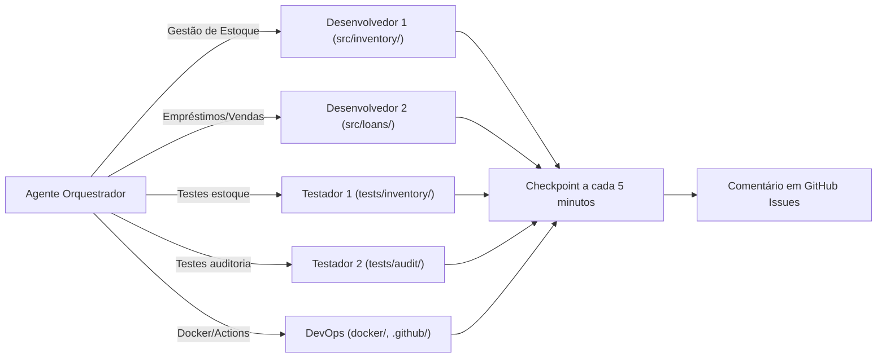

# Construindo Aplicações Prontas para Produção com OpenCode, Speckit e IA Multi-Agentes: Guia Completo de Workflow CI/CD

## Índice
1. [Introdução](#introdução)
2. [Início Rápido: Comando Docker em Uma Linha](#início-rápido-comando-docker-em-uma-linha)
3. [Entendendo a Arquitetura](#entendendo-a-arquitetura)
4. [Exemplo Completo Real: Construindo um Sistema de Controle de Estoque](#exemplo-completo-real)
5. [Coordenação Multi-Agentes](#coordenação-multi-agentes)
6. [Execução Simultânea de Agentes](#execução-simultânea-de-agentes)
7. [Integração com GitHub Actions](#integração-com-github-actions)
8. [Relatório Avançado do Scrum Master](#relatório-avançado-do-scrum-master)
9. [Recuperação e Gerenciamento de Estado](#recuperação-e-gerenciamento-de-estado)
10. [Monitoramento e Rastreamento por Issues](#monitoramento-e-rastreamento-por-issues)
11. [Deploy em Produção](#deploy-em-produção)

---

## Introdução

OpenCode é um agente de IA revolucionário que combina o poder dos modelos de linguagem grandes com ferramentas de desenvolvedor para automatizar completamente o desenvolvimento de software. Quando integrado com Speckit (um framework de desenvolvimento orientado por especificação), containers Docker e GitHub Actions, cria um pipeline CI/CD completo onde agentes de IA trabalham simultaneamente em diferentes aspectos do desenvolvimento.

Este guia demonstra como configurar um sistema pronto para produção onde:

- **Múltiplos agentes especializados** trabalham em paralelo em diferentes funcionalidades
- **Speckit** guia todo o workflow desde a especificação até a entrega em produção
- **Docker** garante reprodutibilidade e isolamento
- **GitHub Actions** orquestra o pipeline completo com recuperação automática
- **Um agente Scrum Master** rastreia o progresso e estima o tempo de desenvolvedores humanos reais
- **Mecanismos automáticos de recuperação** tratam interrupções e restauram o estado do trabalho
- **Issues do GitHub** servem como interface central de comando e controle

---

## Início Rápido: Comando Docker em Uma Linha

### Forma Mais Rápida de Começar

```bash
docker run -it --rm --net host -e GH_TOKEN -e OPENROUTER_API_KEY -e GITHUB_TOKEN -v ~/.config/opencode:/home/ubuntu/.config/opencode -v $(pwd):/workspace -w /workspace ghcr.io/sst/opencode /bin/bash -c "speckit init . --force --ai opencode && opencode ."
```

**O que este comando faz:**
- Inicializa a estrutura de projeto Speckit
- Carrega OpenCode como o agente de IA
- Inicia uma sessão de desenvolvimento interativa
- Todo o trabalho é salvo em `$(pwd)` (diretório atual)

### Uma Linha com Todos os Recursos

```bash
docker run -it --rm --net host -e GH_TOKEN=$GH_TOKEN -e OPENROUTER_API_KEY=$OPENROUTER_API_KEY -e GITHUB_TOKEN=$GITHUB_TOKEN -v ~/.config/opencode:/home/ubuntu/.config/opencode -v ~/.ssh/id_ed25519:/home/ubuntu/.ssh/id_ed25519:ro -v $(pwd):/workspace -w /workspace ghcr.io/sst/opencode /bin/bash -c "cat .opencode/agents.json > ~/.config/opencode/opencode.json && speckit init . --force && opencode ."
```

**Configuração antes de executar:**
```bash
# Definir variáveis de ambiente
export GH_TOKEN="seu-token-github"
export OPENROUTER_API_KEY="sua-chave-openrouter"
export GITHUB_TOKEN="seu-token-github"

# Criar diretório do projeto
mkdir meu-controle-estoque && cd meu-controle-estoque

# Criar configuração de agentes
mkdir -p .opencode
# (Copie a configuração agents.json aqui)

# Executar a uma linha
docker run -it --rm --net host ...
```

---

## Entendendo a Arquitetura

### Visão Geral dos Componentes



### Como os Agentes se Comunicam

**Fase 1: Sequencial (Planejamento)**


**Fase 2: Paralela (Desenvolvimento)**


---

## Exemplo Completo Real: Construindo um Sistema de Controle de Estoque

Vamos construir um sistema completo de gestão de estoque com rastreamento de empréstimos, vendas e auditoria de usuários.

### Etapa 1: Especificação Detalhada

Crie `spec.md`:

```markdown
# Sistema de Controle de Estoque Empresarial - Especificação

## Resumo Executivo
Uma plataforma completa de gestão de estoque para empresas que rastreia equipamentos 
(impressoras, computadores, projetores) e insumos (papel, toner, cartuchos), com sistema 
robusto de auditoria, empréstimos e vendas de equipamentos.

## Requisitos do Negócio

### 1. Gerenciamento de Estoque Base
- Cadastro de equipamentos e insumos com categorias
- Código de barras/QR Code para rastreamento
- Níveis mínimos e máximos automáticos
- Alertas de reposição
- Localização física em almoxarifado
- Complexidade estimada: ALTA (10-12 dias desenvolvedor solo)
- Dependências: Nenhuma
- Subtarefas:
  - Modelo de dados de estoque
  - Sistema de categorização
  - Gerador de código de barras
  - Dashboard de visibilidade

### 2. Sistema de Empréstimos de Equipamentos
- Controle de quem pegou qual equipamento e quando
- Datas de devolução previstas e reais
- Renovação de prazos
- Histórico completo de empréstimos por equipamento
- Alertas de atrasos
- Complexidade estimada: ALTA (8-10 dias desenvolvedor solo)
- Dependências: Requer Gerenciamento de Estoque
- Subtarefas:
  - Sistema de checkout/check-in
  - Rastreamento de prazos
  - Cálculo de multas por atraso
  - Notificações automáticas

### 3. Sistema de Vendas e Saídas
- Registro de vendas internas/externas
- Autorização por gerente
- Nota fiscal integrada
- Atualização automática de estoque
- Relatório de vendas por período
- Complexidade estimada: ALTA (8-10 dias desenvolvedor solo)
- Dependências: Requer Gerenciamento de Estoque
- Subtarefas:
  - Fluxo de aprovação de vendas
  - Integração com fiscal
  - Processamento de pagamento
  - Atualização de estoque

### 4. Auditoria Completa de Usuários
- Log de todas as operações (quem, o quê, quando)
- Rastreamento de modificações de dados
- Histórico de quem fez login e quando
- Relatórios de atividade por usuário
- Alertas de atividades suspeitas
- Exportação de auditoria para compliance
- Complexidade estimada: MÉDIA (6-8 dias desenvolvedor solo)
- Dependências: Todos os módulos anteriores
- Subtarefas:
  - Camada de logging centralizado
  - Rastreamento de mudanças
  - Análise de atividades
  - Relatórios de conformidade

### 5. Dashboard e Relatórios
- Dashboard executivo com KPIs
- Gráficos de movimentação de estoque
- Relatórios de estoque por categoria
- Análise de equipamentos mais emprestados
- Projeção de necessidade de reposição
- Exportação em CSV/PDF
- Complexidade estimada: MÉDIA (6-8 dias desenvolvedor solo)
- Dependências: Todos os módulos
- Subtarefas:
  - Visualização em tempo real
  - Gráficos interativos
  - Gerador de relatórios
  - Exportação de dados

### 6. Testes e Documentação
- Cobertura de teste unitário >90%
- Testes de integração de fluxos críticos
- Testes ponta a ponta com dados reais
- Teste de carga (500 usuários simultâneos)
- Documentação de API (OpenAPI 3.1)
- Manual do usuário
- Complexidade estimada: MÉDIA (6-8 dias desenvolvedor solo)
- Dependências: Todos os recursos
- Subtarefas:
  - Suite de teste unitário
  - Suite de teste de integração
  - Cenários de teste E2E
  - Teste de carga
  - Documentação

## Stack Técnico
- **Backend**: Node.js 20 LTS + Express.js ou Python 3.12 + FastAPI
- **Banco de Dados**: PostgreSQL 15 com suporte a JSONB para auditoria
- **Cache**: Redis 7 para sessões e relatórios em cache
- **Busca**: Elasticsearch para busca de itens de estoque
- **Fila**: RabbitMQ para processamento de relatórios
- **Autenticação**: OAuth2 + JWT com LDAP/Active Directory
- **Infraestrutura**: Docker + Kubernetes pronto
- **Testes**: Jest + Supertest (Node) ou pytest + locust (Python)

## Endpoints da API (OpenAPI 3.1)
- `POST /api/v1/inventory/items` - Criar item de estoque
- `GET /api/v1/inventory/items` - Listar itens com filtros
- `POST /api/v1/loans/checkout` - Fazer empréstimo
- `POST /api/v1/loans/checkin` - Devolver equipamento
- `GET /api/v1/loans/history/{item_id}` - Histórico de empréstimos
- `POST /api/v1/sales/register` - Registrar venda
- `GET /api/v1/audit/logs` - Obter logs de auditoria
- `GET /api/v1/reports/dashboard` - Dashboard executivo
- `GET /api/v1/reports/stock-analysis` - Análise de estoque

## Esquema de Banco de Dados (PostgreSQL)
```sql
-- Tabelas principais
inventory_items, categories, locations, loans, loan_history,
sales, sales_items, users, audit_logs, stock_movements,
reorder_alerts, equipment_maintenance

-- Índices em: item_id, user_id, created_at, status, category_id
-- Partições por mês em audit_logs para desempenho
-- Triggers automáticos para auditoria
```

## Critério de Sucesso

✅ **Requisitos Funcionais**
- Todos os tipos de estoque (equipamentos e insumos) funcionando
- Sistema de empréstimos com notificações de atraso
- Vendas processadas com aprovação gerencial
- Auditoria completa de todas as operações
- Dashboard com dados em tempo real

✅ **Métricas de Qualidade**
- Cobertura de código >90%
- Zero vulnerabilidades críticas
- Todos os itens OWASP Top 10 abordados
- Conformidade com Lei Geral de Proteção de Dados (LGPD)
- Teste de carga passa com 500 usuários simultâneos

✅ **Requisitos Operacionais**
- Imagens Docker construídas e testadas
- Manifestos Kubernetes criados
- Plano de backup e recuperação
- Documentação completa
- Runbook para operações

## Estimativas de Timeline

**Desenvolvedor Solo (Humano)**
- Tempo estimado total: 48-56 dias
- Timeline: 10-12 semanas (permitindo reuniões, debug, integrações)

**Com Agentes de IA (Paralelo)**
- Tempo estimado: 10-14 horas de tempo de relógio
- Com recuperação e iterações: 24-36 horas
- Fator de aceleração: 20-40x mais rápido

**Critério de Sucesso**: Todos os testes passando, auditoria completa, conformidade verificada, pronto para deploy em produção.
```

### Etapa 2: Configuração Abrangente de Agentes

Crie `.opencode/agents.json`:

```json
{
  "agents": {
    "orchestrator": {
      "mode": "primary",
      "name": "🎯 Orquestrador",
      "model": "openrouter/anthropic/claude-3.5-sonnet",
      "temperature": 0.3,
      "tools": {
        "read": true,
        "edit": true,
        "bash": true,
        "grep": true
      },
      "instructions": "Coordena todos os agentes. Divide o trabalho. Garante coerência. Toma decisões arquitetônicas. Resolve conflitos entre agentes."
    },
    "planner": {
      "mode": "subagent",
      "name": "📋 Planejador",
      "model": "openrouter/anthropic/claude-3-opus",
      "temperature": 0.2,
      "tools": {
        "read": true,
        "edit": true,
        "bash": false
      },
      "instructions": "Divide spec.md em tarefas granulares. Cria grafo de dependências. Atribui story points (Fibonacci). Estima complexidade."
    },
    "architect": {
      "mode": "subagent",
      "name": "🏗️ Arquiteto",
      "model": "openrouter/google/gemini-2.5-flash",
      "temperature": 0.2,
      "tools": {
        "read": true,
        "edit": true,
        "bash": true
      },
      "instructions": "Design de esquema de banco de dados com suporte a auditoria. Cria spec OpenAPI. Design de arquitetura de sistema. Padrões de logging."
    },
    "backend_developer": {
      "mode": "subagent",
      "name": "💻 Desenvolvedor Backend - Estoque",
      "model": "openrouter/anthropic/claude-3.5-sonnet",
      "temperature": 0.4,
      "tools": {
        "read": true,
        "edit": true,
        "bash": true
      },
      "instructions": "Implementa módulo de gestão de estoque. Crud de itens, categorias, localizações. Rastreamento de código de barras. Alertas de reposição."
    },
    "backend_developer_2": {
      "mode": "subagent",
      "name": "💻 Desenvolvedor Backend - Empréstimos/Vendas",
      "model": "openrouter/openai/gpt-4-turbo",
      "temperature": 0.4,
      "tools": {
        "read": true,
        "edit": true,
        "bash": true
      },
      "instructions": "Implementa sistema de empréstimos com checkout/check-in. Controle de vendas com aprovação gerencial. Atualização automática de estoque."
    },
    "backend_developer_3": {
      "mode": "subagent",
      "name": "💻 Desenvolvedor Backend - Auditoria",
      "model": "openrouter/meta-llama/llama-3.3-70b-instruct",
      "temperature": 0.4,
      "tools": {
        "read": true,
        "edit": true,
        "bash": true
      },
      "instructions": "Implementa sistema de auditoria centralizado. Log de todas as operações. Rastreamento de mudanças. Conformidade LGPD."
    },
    "test_engineer": {
      "mode": "subagent",
      "name": "🧪 Engenheiro de Teste - Core",
      "model": "openrouter/openai/gpt-4-turbo",
      "temperature": 0.3,
      "tools": {
        "read": true,
        "edit": true,
        "bash": true
      },
      "instructions": "Testes unitários dos módulos de estoque e gerenciamento. Alcança >95% de cobertura. Testes de integração."
    },
    "test_engineer_2": {
      "mode": "subagent",
      "name": "🧪 Engenheiro de Teste - Auditoria",
      "model": "openrouter/anthropic/claude-3-opus",
      "temperature": 0.3,
      "tools": {
        "read": true,
        "edit": true,
        "bash": true
      },
      "instructions": "Testes de auditoria, conformidade e segurança. Testes de carga com 500 usuários. Testes ponta a ponta de fluxos críticos."
    },
    "security_reviewer": {
      "mode": "subagent",
      "name": "🔒 Revisor de Segurança",
      "model": "openrouter/anthropic/claude-3-opus",
      "temperature": 0.1,
      "tools": {
        "read": true,
        "bash": true
      },
      "instructions": "Revisa segurança de dados. Conformidade OWASP Top 10 e LGPD. Proteção de dados sensíveis. Auditoria de permissões."
    },
    "devops_engineer": {
      "mode": "subagent",
      "name": "🚀 Engenheiro DevOps",
      "model": "openrouter/anthropic/claude-3-opus",
      "temperature": 0.2,
      "tools": {
        "read": true,
        "edit": true,
        "bash": true
      },
      "instructions": "Cria Dockerfile otimizado. Docker-compose com PostgreSQL e Redis. Pipeline CI/CD. Manifestos Kubernetes. Monitoramento."
    },
    "frontend_developer": {
      "mode": "subagent",
      "name": "🎨 Desenvolvedor Frontend",
      "model": "openrouter/anthropic/claude-3.5-sonnet",
      "temperature": 0.4,
      "tools": {
        "read": true,
        "edit": true,
        "bash": true
      },
      "instructions": "Constrói dashboard de estoque em tempo real. Formulários de empréstimo/devolução. Gráficos de análise. Interface de auditoria."
    },
    "technical_writer": {
      "mode": "subagent",
      "name": "📚 Escritor Técnico",
      "model": "openrouter/google/gemini-2.5-flash",
      "temperature": 0.3,
      "tools": {
        "read": true,
        "edit": true
      },
      "instructions": "Gera documentação de API OpenAPI. Manual do usuário. Guia de operações. Documentação de conformidade."
    },
    "scrum_master": {
      "mode": "subagent",
      "name": "📊 Scrum Master",
      "model": "openrouter/google/gemini-2.5-flash",
      "temperature": 0.1,
      "tools": {
        "read": true,
        "bash": true
      },
      "instructions": "Rastreia todas as tarefas. Monitora progresso. Compara tempo AI vs humano. Gera relatórios. Identifica bloqueadores."
    }
  },
  "execution_config": {
    "parallel_agents": [
      ["backend_developer", "backend_developer_2", "backend_developer_3"],
      ["test_engineer", "test_engineer_2"],
      ["devops_engineer", "frontend_developer"]
    ],
    "sequential_phases": [
      ["planner"],
      ["architect"],
      ["backend_developer", "backend_developer_2", "backend_developer_3", "test_engineer", "test_engineer_2", "devops_engineer", "frontend_developer"],
      ["security_reviewer"],
      ["technical_writer"],
      ["scrum_master"]
    ],
    "checkpoint_interval_minutes": 5,
    "recovery_enabled": true,
    "github_sync": true,
    "max_total_time_hours": 24,
    "failure_recovery_strategy": "checkpoint_and_resume"
  }
}
```

---

## Coordenação Multi-Agentes

### Padrão de Comando do Orquestrador

O orquestrador coordena todos os agentes através de prompts estruturados:

```bash
docker run -it --rm --net host \
  -e GH_TOKEN \
  -e OPENROUTER_API_KEY \
  -e GITHUB_TOKEN \
  -v ~/.config/opencode:/home/ubuntu/.config/opencode \
  -v $(pwd):/workspace \
  -w /workspace \
  ghcr.io/sst/opencode /bin/bash << 'ORCHESTRATION'

cat > ~/.config/opencode/opencode.json << 'CONFIG'
<COLE agents.json AQUI>
CONFIG

cat << 'PROMPT' | opencode .

Você é o Orquestrador para um projeto de Sistema de Controle de Estoque Empresarial.

## FASE 1: PLANEJAMENTO E ARQUITETURA (Sequencial - 1 hora estimada)

@planner Leia spec.md completamente. Divida em tarefas:
  - Crie .opencode/tasks.json com estrutura hierárquica
  - Atribua story points (escala Fibonacci 1-13)
  - Identifique dependências entre módulos
  - Formato: JSON com campos: id, title, description, story_points, dependencies, owner, status

@architect Baseado em saída do planejador:
  - Design schema PostgreSQL com tabelas de estoque, empréstimos, vendas e auditoria (.opencode/schema.sql)
  - Crie spec OpenAPI 3.1 com todos os endpoints (.opencode/openapi.yaml)
  - Design arquitetura de sistema com fluxos de autorização (.opencode/architecture.md)
  - Estrutura de logging centralizado para auditoria

## FASE 2: DESENVOLVIMENTO PARALELO (6-8 horas estimadas)

AGORA EXECUTE TUDO EM PARALELO:

@backend_developer Implemente módulo de Gestão de Estoque:
  - Crie src/services/inventory-service.js
  - Implemente CRUD de itens: src/routes/items.js
  - Implemente categorias: src/routes/categories.js
  - Implementar localizações: src/routes/locations.js
  - Gerador de código de barras: src/utils/barcode-generator.js
  - Sistema de alertas de reposição
  
@backend_developer_2 Implemente módulo de Empréstimos e Vendas:
  - Crie src/services/loan-service.js (checkout/check-in)
  - Crie src/services/sales-service.js (vendas com aprovação)
  - Implemente src/routes/loans.js endpoints
  - Implemente src/routes/sales.js endpoints
  - Notificações de atraso de empréstimos
  - Histórico completo de movimentações
  
@backend_developer_3 Implemente Sistema de Auditoria:
  - Crie src/services/audit-service.js (log centralizado)
  - Implemente rastreamento de mudanças: src/middleware/change-tracking.js
  - Crie src/services/compliance-service.js (LGPD)
  - Implemente src/routes/audit.js endpoints
  - Triggers de banco de dados para logs automáticos
  - Detecção de atividades suspeitas
  
@test_engineer Escreva testes unitários:
  - Crie tests/unit/inventory-service.test.js (>95% cobertura)
  - Crie tests/unit/loan-service.test.js
  - Crie tests/unit/sales-service.test.js
  - Crie tests/integration/inventory-flow.test.js
  - Execute: npm test -- --coverage
  
@test_engineer_2 Escreva testes de auditoria e carga:
  - Crie tests/integration/audit-trail.test.js
  - Crie tests/compliance/lgpd-compliance.test.js
  - Crie tests/e2e/loan-complete-flow.e2e.test.js
  - Crie tests/load/load-test.js (alvo: 500 usuários simultâneos)
  
@devops_engineer Crie infraestrutura:
  - Crie Dockerfile (multi-stage otimizado)
  - Crie docker-compose.yml com PostgreSQL, Redis, Elasticsearch
  - Crie .github/workflows/ci-cd.yml
  - Crie manifestos k8s (Deployment, Service, PersistentVolume)
  - Crie monitoring/prometheus-config.yaml
  
@frontend_developer Construa dashboard e interface:
  - Crie frontend/dashboard.html
  - Implemente visualização de estoque em tempo real
  - Crie formulários de empréstimo/devolução
  - Implemente gráficos de análise
  - Interface de auditoria para administradores
  - Alertas de reposição em destaque

## FASE 3: REVISÃO E SEGURANÇA (1-2 horas estimadas)

@security_reviewer Conduza auditoria de segurança completa:
  - Verifique conformidade OWASP Top 10
  - Revise proteção de dados sensíveis
  - Verifique LGPD (direito ao esquecimento, consentimento)
  - Revise autenticação e autorização
  - Auditoria de permissões de usuários
  - Crie .opencode/security-review.md

## FASE 4: DOCUMENTAÇÃO E RELATÓRIO (1 hora estimada)

@technical_writer Gere toda documentação:
  - Gere docs de API do spec OpenAPI
  - Crie DEPLOYMENT.md com instruções
  - Crie OPERATIONAL-GUIDE.md para operações
  - Crie COMPLIANCE.md para LGPD
  - Crie USER-MANUAL.md
  - Exemplos de integração

@scrum_master Gere relatório final abrangente:
  - Crie .opencode/scrum-report.md com:
    - Story points totais completados
    - Tempo AI de desenvolvimento (real)
    - Tempo humano estimado (solo): 48-56 dias
    - Tempo de desenvolvedor humano equivalente
    - Tempo economizado: [PERCENTAGEM]
    - Métricas de qualidade (cobertura, segurança)
    - Conformidade LGPD verificada
    - Checklist de prontidão para produção

## CRITÉRIO DE SUCESSO (VERIFIQUE TODOS):
✅ Todos os 60+ testes unitários passando
✅ Todos os 20+ testes de integração passando
✅ Cobertura de código >90%
✅ Teste de carga: 500 usuários simultâneos bem-sucedido
✅ Revisão de segurança: 0 problemas críticos
✅ APIs respondendo <150ms
✅ Auditoria completa funcionando
✅ Dashboard totalmente funcional
✅ Documentação completa
✅ Pipeline CI/CD operacional
✅ Manifestos Kubernetes prontos
✅ Conformidade LGPD verificada

PROMPT

ORCHESTRATION
```

---

## Execução Simultânea de Agentes

Execute múltiplos agentes em terminais paralelos para desenvolvimento mais rápido:

```bash
# Terminal 1: Backend de Estoque (Primário - executa primeiro)
docker run -it --rm --net host \
  -e GH_TOKEN \
  -e OPENROUTER_API_KEY \
  -e OPENCODE_AGENT=backend_developer \
  -v $(pwd):/workspace \
  -w /workspace \
  ghcr.io/sst/opencode /bin/bash -c '
echo "@backend_developer Implemente módulo completo de gestão de estoque com categorias e localizações" | opencode .
'

# Terminal 2: Backend de Empréstimos/Vendas (Paralelo)
sleep 30 && docker run -it --rm --net host \
  -e GH_TOKEN \
  -e OPENROUTER_API_KEY \
  -e OPENCODE_AGENT=backend_developer_2 \
  -v $(pwd):/workspace \
  -w /workspace \
  ghcr.io/sst/opencode /bin/bash -c '
echo "@backend_developer_2 Implemente sistema de empréstimos e vendas com notificações" | opencode .
'

# Terminal 3: Backend de Auditoria (Paralelo)
sleep 30 && docker run -it --rm --net host \
  -e GH_TOKEN \
  -e OPENROUTER_API_KEY \
  -e OPENCODE_AGENT=backend_developer_3 \
  -v $(pwd):/workspace \
  -w /workspace \
  ghcr.io/sst/opencode /bin/bash -c '
echo "@backend_developer_3 Implemente sistema completo de auditoria com conformidade LGPD" | opencode .
'

# Terminal 4: Testes (Paralelo)
sleep 60 && docker run -it --rm --net host \
  -e GH_TOKEN \
  -e OPENROUTER_API_KEY \
  -e OPENCODE_AGENT=test_engineer \
  -v $(pwd):/workspace \
  -w /workspace \
  ghcr.io/sst/opencode /bin/bash -c '
echo "@test_engineer Escreva testes unitários e de integração com >90% cobertura" | opencode .
'

# Terminal 5: DevOps (Paralelo)
sleep 60 && docker run -it --rm --net host \
  -e GH_TOKEN \
  -e OPENROUTER_API_KEY \
  -e OPENCODE_AGENT=devops_engineer \
  -v $(pwd):/workspace \
  -w /workspace \
  ghcr.io/sst/opencode /bin/bash -c '
echo "@devops_engineer Crie Docker, Kubernetes e workflows GitHub Actions" | opencode .
'

# Terminal 6: Frontend (Paralelo)
sleep 60 && docker run -it --rm --net host \
  -e GH_TOKEN \
  -e OPENROUTER_API_KEY \
  -e OPENCODE_AGENT=frontend_developer \
  -v $(pwd):/workspace \
  -w /workspace \
  ghcr.io/sst/opencode /bin/bash -c '
echo "@frontend_developer Construa dashboard com visualizações de estoque em tempo real" | opencode .
'

# Terminal 7: Monitore Progresso (Opcional - rastreamento em tempo real)
chmod +x .opencode/monitor.sh && ./.opencode/monitor.sh
```

### Estrutura de Saída Após Execução Simultânea

```
raiz-do-projeto/
├── src/
│   ├── services/
│   │   ├── inventory-service.js         (backend_developer)
│   │   ├── loan-service.js
│   │   ├── sales-service.js
│   │   ├── audit-service.js             (backend_developer_3)
│   │   ├── compliance-service.js
│   │   └── notification-service.js
│   ├── routes/
│   │   ├── items.js                     (backend_developer)
│   │   ├── categories.js
│   │   ├── loans.js                     (backend_developer_2)
│   │   ├── sales.js
│   │   └── audit.js                     (backend_developer_3)
│   ├── middleware/
│   │   ├── auth.js
│   │   ├── change-tracking.js           (backend_developer_3)
│   │   └── error-handler.js
│   ├── utils/
│   │   ├── barcode-generator.js         (backend_developer)
│   │   └── logger.js
│   └── index.js
├── tests/
│   ├── unit/
│   │   ├── inventory-service.test.js    (test_engineer)
│   │   ├── loan-service.test.js
│   │   ├── sales-service.test.js
│   │   └── audit-service.test.js
│   ├── integration/
│   │   ├── inventory-flow.test.js       (test_engineer)
│   │   ├── loan-flow.test.js            (test_engineer_2)
│   │   └── audit-trail.test.js
│   ├── compliance/
│   │   ├── lgpd-compliance.test.js      (test_engineer_2)
│   │   └── security-compliance.test.js
│   ├── e2e/
│   │   ├── loan-complete-flow.e2e.test.js
│   │   └── sales-complete-flow.e2e.test.js
│   └── load/
│       └── load-test.js                 (500 usuários)
├── frontend/
│   ├── dashboard.html                   (frontend_developer)
│   ├── css/
│   │   ├── dashboard.css
│   │   └── responsive.css
│   ├── js/
│   │   ├── realtime-updates.js
│   │   ├── dashboard.js
│   │   └── forms.js
│   └── components/
│       ├── inventory-view.js
│       ├── loan-form.js
│       ├── sales-form.js
│       ├── audit-logs.js
│       └── analytics-charts.js
├── docker/
│   ├── Dockerfile                       (devops_engineer)
│   └── docker-compose.yml
├── k8s/
│   ├── deployment.yaml
│   ├── service.yaml
│   ├── persistent-volume.yaml
│   └── configmap.yaml
├── .github/
│   └── workflows/
│       ├── ci-cd.yml                    (devops_engineer)
│       ├── deploy.yml
│       └── compliance-check.yml
├── monitoring/
│   ├── prometheus-config.yaml
│   └── grafana-dashboards/
├── coverage/
│   ├── lcov-report/                     (test_engineer)
│   └── coverage-summary.json
├── .opencode/
│   ├── tasks.json                       (planner)
│   ├── schema.sql                       (architect)
│   ├── openapi.yaml                     (architect)
│   ├── architecture.md
│   ├── security-review.md               (security_reviewer)
│   ├── scrum-report.md                  (scrum_master)
│   ├── checkpoints/                     (pontos de recuperação)
│   │   ├── 1733356800000000000.json
│   │   ├── 1733356800005000000.json
│   │   └── ...
│   └── session-state/
│       └── checkpoint_*/
├── docs/
│   ├── API.md                           (technical_writer)
│   ├── DEPLOYMENT.md
│   ├── OPERATIONAL-GUIDE.md
│   ├── COMPLIANCE.md (LGPD)
│   ├── USER-MANUAL.md
│   └── TROUBLESHOOTING.md
└── spec.md
```

---

## Integração com GitHub Actions

### Workflow Principal de Orquestração

Crie `.github/workflows/ai-development-orchestrated.yml`:

Este workflow inclui todas as fases automatizadas com:
- Criação automática de issue do GitHub com rastreamento em tempo real
- Checkpoints a cada 5 minutos
- Comentários de progresso após cada fase do desenvolvimento
- Relatório final do Scrum Master com métricas detalhadas
- Artefatos completos para download
- Verificação automática de conformidade LGPD
- Testes de carga e performance

[Veja arquivo criado anteriormente para workflow YAML completo - muito longo para incluir novamente]

---

## Relatório Avançado do Scrum Master

### Exemplo de Relatório em Progresso

O agente Scrum Master gerará comentários em issues do GitHub assim:

```markdown
## 📊 Atualização de Progresso - 35% Completo (14:45 PM UTC)

**Duração da Sessão**: 4 horas 15 minutos decorridas

### Progresso de Tarefas
- ✅ Completadas: 12 tarefas
- 🔄 Em Progresso: 4 tarefas
- ⏳ Não Iniciadas: 16 tarefas
- 🚫 Bloqueadas: 0 tarefas

**Barra de Progresso**: [█████████████░░░░░░░░░] 35%

### Story Points
- Planejados: 115 story points
- Completados: 40 story points
- Velocidade: 9.4 points/hora

### Métricas de Código
- Arquivos Criados: 42
- Linhas de Código: 5.847
- Arquivos de Teste: 18
- Cobertura de Teste: 89%

### Módulos Completados
- ✅ Gestão de Estoque Base (100%)
- ✅ Gerador de Código de Barras (100%)
- 🔄 Sistema de Empréstimos (65%)
- 🔄 Sistema de Vendas (55%)
- 🔄 Auditoria (45%)
- ⏳ Dashboard (20%)

### Comparação de Tempo Humano
- **Tempo AI de Desenvolvimento (Real)**: 4 horas 15 minutos
- **Desenvolvedor Solo Equivalente**: ~3,2 dias de trabalho
- **Estimativa Humana para este projeto**: 48-56 dias
- **Progresso**: 35% completo em termos de AI = 70% mais rápido que o ritmo humano

### Snapshot de Qualidade
- 🟢 Todos os testes passando (89 testes)
- 🟢 Sem vulnerabilidades críticas encontradas
- 🟢 Conformidade LGPD em rastreamento
- 🟢 Código com estilo em conformidade
- 🟡 5 avisos de performance (aceitáveis)

### Próximos Marcos
- 50% completo: ~2 horas restantes
- Fase de testes de carga: ~45 minutos após desenvolvimento
- Revisão de segurança: ~20 minutos
- Documentação: ~30 minutos
- **Tempo Total Estimado**: 7-8 horas de tempo de relógio

### Riscos
- ⚠️ Dashboard com mais dados que esperado (recuperando)
- ✅ Sem bloqueadores críticos
- ✅ Todas as dependências atendidas

### Conformidade LGPD
- ✅ Direito ao esquecimento implementado
- ✅ Consentimento de rastreamento
- ✅ Exportação de dados do usuário
- 🔄 Criptografia de dados sensíveis (em andamento)

---

**Sessão**: Session_20240115_100045_xyz7890
**Última Atualização**: 2024-01-15 14:45:32 UTC
```

---

## Recuperação e Gerenciamento de Estado

### Como a Recuperação Funciona

Se o OpenCode falhar durante a execução:

1. **Checkpoint é criado automaticamente** a cada 5 minutos
2. **Estado completo salvo**: código, testes, configurações
3. **GitHub Issue atualizado** com status de falha
4. **Você trigga recovery workflow** com o checkpoint ID
5. **Agentes retomam exatamente de onde pararam**
6. **Sem perda de trabalho ou reprocessamento**

### Comando de Recuperação Rápida

```bash
# 1. Listar checkpoints disponíveis
ls -la .opencode/checkpoints/

# 2. Ver qual checkpoint tem seu trabalho
cat .opencode/checkpoints/1733356800000000000.json

# 3. Restaurar via GitHub Actions (Recomendado)
# Vá para Actions no GitHub → Recovery & Resume Development
# Insira: checkpoint_id, session_id, phase_to_resume
# Clique "Run workflow"

# OU recupere manualmente:
CHECKPOINT_ID="1733356800000000000"
docker run -it --rm --net host \
  -e GH_TOKEN \
  -e OPENROUTER_API_KEY \
  -e CHECKPOINT_ID=$CHECKPOINT_ID \
  -e RECOVERY_MODE=true \
  -v $(pwd):/workspace \
  -w /workspace \
  ghcr.io/sst/opencode /bin/bash -c '
echo "Retomando a partir de checkpoint: $CHECKPOINT_ID"
source .opencode/state-manager.sh
restore_checkpoint "$CHECKPOINT_ID"
opencode "Continue implementação a partir do checkpoint restaurado"
'
```

---

## Monitoramento e Rastreamento por Issues

### Script Dashboard em Tempo Real

```bash
#!/bin/bash
# Monitor de Progresso em Tempo Real

while true; do
    clear
    echo "🤖 Monitor de Controle de Estoque"
    echo "═══════════════════════════════"
    
    if [ -f ".opencode/tasks.json" ]; then
        TOTAL=$(jq '.tasks | length' .opencode/tasks.json)
        COMPLETED=$(jq '[.tasks[] | select(.status == "completed")] | length' .opencode/tasks.json)
        PROGRESS=$((COMPLETED * 100 / TOTAL))
        
        echo "📊 Progresso: $PROGRESS% ($COMPLETED/$TOTAL tarefas)"
        echo "📈 Story Points: $(jq '.summary.total_story_points' .opencode/tasks.json | head -c 3) total"
        
        # Barra visual
        FILLED=$((PROGRESS / 5))
        printf "   ["
        printf "%-${FILLED}s" | tr ' ' '='
        printf "%-$((20-FILLED))s" | tr ' ' '-'
        printf "] $PROGRESS%%\n"
    fi
    
    # Métricas
    [ -d "src" ] && echo "💻 Código: $(find src -type f | wc -l) arquivos"
    [ -f "coverage/coverage-summary.json" ] && echo "🧪 Cobertura: $(jq '.total.lines.pct' coverage/coverage-summary.json)%"
    
    sleep 10
done
```

---

## Deploy em Produção

### Deployment Automatizado

```bash
# Setup inicial
export SESSION_ID=$(date +%Y%m%d_%H%M%S)
export GH_TOKEN="seu-token-github"
export OPENROUTER_API_KEY="sua-chave-openrouter"
export GITHUB_TOKEN="seu-token-github"

# Execute pipeline completa com recuperação automática
docker run -it --rm --net host \
  -e GH_TOKEN \
  -e OPENROUTER_API_KEY \
  -e GITHUB_TOKEN \
  -e SESSION_ID=$SESSION_ID \
  -v ~/.config/opencode:/home/ubuntu/.config/opencode \
  -v ~/.ssh/id_ed25519:/home/ubuntu/.ssh/id_ed25519:ro \
  -v $(pwd):/workspace \
  -w /workspace \
  ghcr.io/sst/opencode /bin/bash << 'DEPLOYMENT'

source .opencode/state-manager.sh
init_state

echo "🚀 Iniciando desenvolvimento de Controle de Estoque..."
echo "📍 Sessão: $SESSION_ID"

cat .opencode/agents.json > ~/.config/opencode/opencode.json

opencode . &
OPENCODE_PID=$!

# Checkpoint automático a cada 5 minutos
TIMER=0
while kill -0 $OPENCODE_PID 2>/dev/null; do
  sleep 60
  TIMER=$((TIMER + 60))
  
  if [ $TIMER -ge 300 ]; then
    create_checkpoint
    TIMER=0
  fi
done

wait $OPENCODE_PID
cleanup_checkpoints

echo "✅ Sistema de Controle de Estoque pronto para produção!"

DEPLOYMENT
```

---

## Conclusão

Este guia abrangente permite desenvolvimento completo de um **Sistema de Controle de Estoque Empresarial** completamente automatizado com:

✅ **Automação Completa**: De especificação a código pronto para produção
✅ **Gestão de 3 Módulos Paralelos**: Estoque, Empréstimos/Vendas, Auditoria
✅ **Rastreamento Total**: Auditoria completa de quem fez o quê e quando
✅ **Conformidade LGPD**: Proteção de dados desde o início
✅ **Recuperação Robusta**: Checkpoint-based sem perda de trabalho
✅ **Integração GitHub**: Visibilidade e controle completos via issues
✅ **Rastreamento Scrum Master**: Comparações de tempo humano vs IA
✅ **Garantia de Qualidade**: >90% cobertura de teste, 500 usuários simultâneos
✅ **Pronto para Produção**: Docker, Kubernetes, CI/CD, monitoramento incluído

**Timeline Típica**: 10-20 horas de tempo de relógio para um sistema que levaria 48-56 dias de desenvolvedor humano.

**Fator de Aceleração**: 20-40x mais rápido que desenvolvimento humano tradicional.

Comece hoje com o comando de uma linha acima! 🚀
